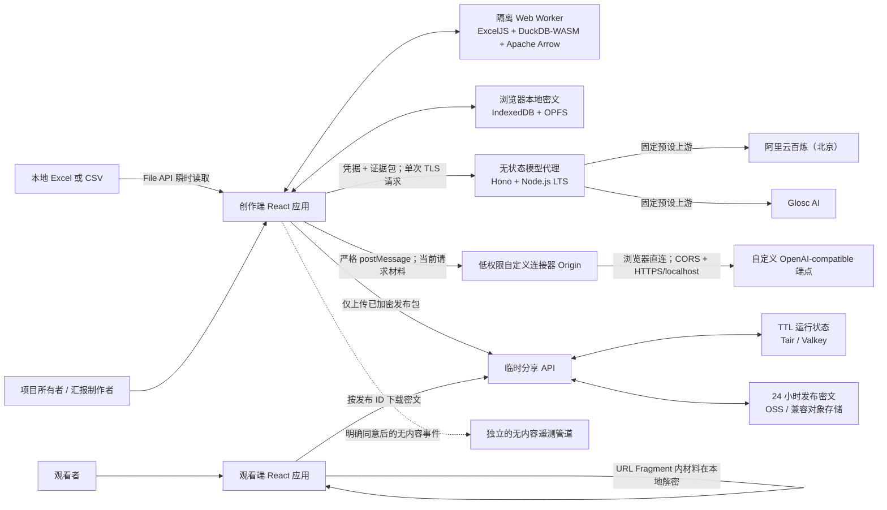
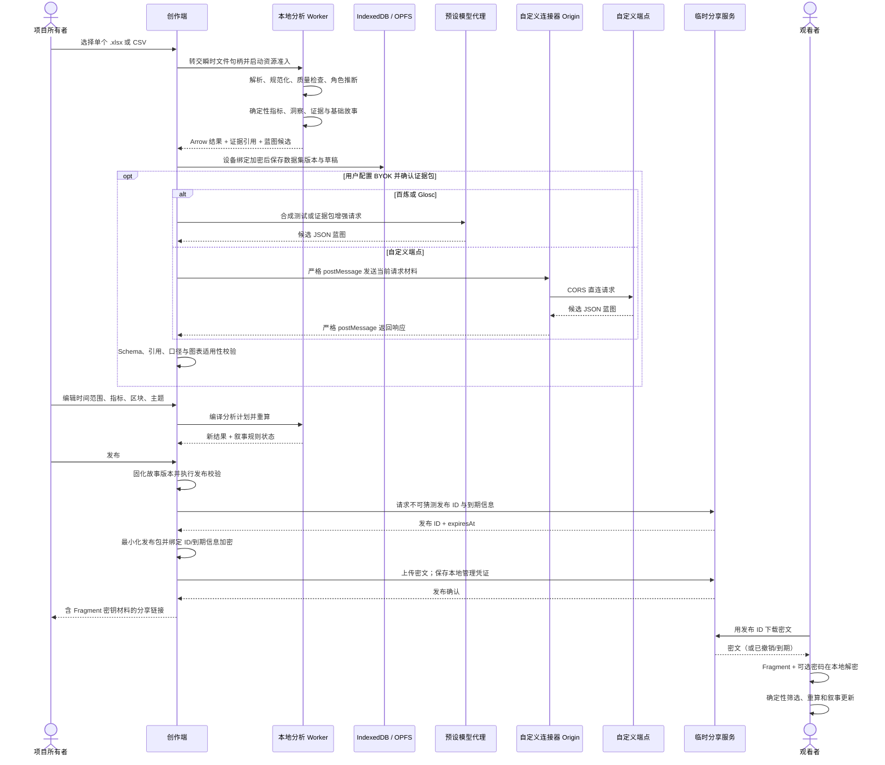
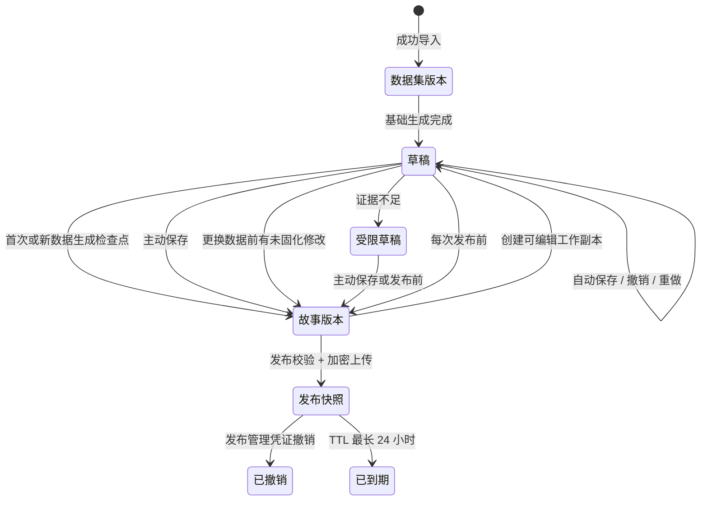

# DataPulse AI 技术架构

> 状态：MVP 实施基线  
> 更新日期：2026-08-04（Asia/Shanghai）  
> 适用范围：创作端、观看端、本地分析、模型配置与调用、临时分享服务、官方阿里云实例与社区自部署参考  
> 规范优先级：版本化 JSON Schema 与已接受 ADR 是实现约束；本文负责把这些约束组织成可实施的系统边界，不替代 Schema 或 ADR。

## 1. 架构目标与硬约束

DataPulse AI 把一份规范的 Excel/CSV 单表转化为可验证、可编辑、可临时分享的数据故事。MVP 是一次性汇报工具，不是实时 BI。系统必须同时满足以下目标：

1. **数值可复算**：指标、洞察、图表和叙事都源于同一确定性分析语义；模型不得计算或替换事实。
2. **本地数据驻留**：原始文件与未明确发布的记录只在创作者浏览器内处理，不因设备性能不足回退到云端。
3. **安全分享**：发布包在浏览器端加密；DataPulse 云端只保存密文和严格 TTL 的运行状态。
4. **一键生成后可编辑**：基础生成不依赖模型；AI 增强是可选覆盖层，所有编辑可见、可撤销并触发依赖重算。
5. **长期可读**：本地项目、项目包与发布快照携带 `schemaVersion`，正式版本之间保留永久迁移链。
6. **受控渲染**：AI 只生成故事蓝图，不能生成或执行任意 JavaScript、CSS、HTML、Shader 或 WebGL 代码。
7. **可降级而不丢信息**：二维内容先可读，3D、动效、Canvas 仅作渐进增强；无障碍是发布门槛。
8. **免费与可审计**：全栈代码、协议、基础设施配置和测试在单一公开 monorepo 中以 AGPL-3.0 开源；模型费用由项目所有者通过 BYOK 承担。

关键决策见 [ADR-0001](adr/0001-data-stories-over-live-dashboards.md)、[ADR-0002](adr/0002-controlled-story-renderer.md)、[ADR-0020](adr/0020-analyze-raw-data-in-browser.md)、[ADR-0024](adr/0024-end-to-end-encrypted-published-snapshots.md) 与 [ADR-0028](adr/0028-fully-open-source-under-agpl.md)。

### 1.1 MVP 架构非目标

架构不得为下列延期能力预埋绕过当前边界的“临时入口”：实时/定时数据源、多表关联、账号与多人协作、云端项目同步、永久分享、任意 SQL/代码/文本公式、自由画布、预测或因果推断、云端原始数据分析、平台公共 AI 额度、自定义端点代理、手填模型 ID、PPTX/视频/GIF 导出、手机创作和企业专属交付。完整范围冻结见 [ADR-0044](adr/0044-freeze-mvp-boundaries.md)。

## 2. 系统上下文与信任边界



官方部署必须使用四个不同的 scheme/host/port Origin 分别承载创作端、观看端、API（模型代理、分享与遥测入口）和自定义连接器；社区参考部署保持同一不变量。路径不能隔离 IndexedDB、OPFS、CryptoKey 或 Service Worker，因此不得用同一 Origin 下的不同路径替代隔离。Cookie 也不按端口隔离，`Clear-Site-Data: "cookies"` 还会作用于整个可注册域：每个连接器安全纪元必须使用一个不承载创作端、观看端、API 或其他应用的独占可注册域，而不能只是它们的兄弟子域；DataPulse 页面与 API 不使用 Cookie 做身份、会话或遥测，若基础设施必须设置 Cookie，则全部使用 `__Host-` 前缀并满足 `Secure; Path=/`、无 `Domain`。日常本地开发可以用不同端口建立非 Cookie 的 Origin 边界，但全部应用必须保持无 Cookie；Cookie 隔离与清理的发布测试必须使用映射到不同可注册域的 HTTPS 测试主机，不能以端口差异作为通过依据。观看端与连接器因此不能读取创作端持久状态或这些 host-bound Cookie，连接器的清理响应也不会删除其他应用的 Cookie。

信任边界如下：

| 边界 | 可以接触的内容 | 明确禁止 |
|---|---|---|
| 创作端主线程 | UI 状态、解密后的当前草稿、用户选择 | 执行上传文件、AI 输出或发布内容中的代码 |
| 本地分析 Worker | 原始单表、规范数据、指标计划和聚合结果 | 任何网络访问、运行时脚本／WASM 拉取、动态导入、嵌套 Worker、静默抽样、执行公式或宏；单文件包与响应 CSP 共同强制 |
| 创作端 Origin 的持久存储 | 设备绑定加密后的项目数据、索引和能力测试 | 明文原始数据、`localStorage` 中的数据或密钥、其他 Origin 读取 |
| DataPulse 模型代理 | 单次请求期间的模型凭据和已确认证据包 | 原始表、任意上游 URL、凭据/正文日志与持久化 |
| 第三方模型供应商 | 用户确认发送的证据包 | DataPulse 对其留存、训练、地域或 SLA 作未经条款支持的承诺 |
| 自定义连接器 Origin | 当前一次请求的已确认证据包、临时凭据、经校验端点和模型响应 | 读取创作端存储／设备密钥、跨请求保留材料、注册 Service Worker、顶层导航或调用 DataPulse 代理 |
| 临时分享云端 | 发布密文、对象大小、访问与配额元数据、TTL 状态 | 分享密钥、密码、发布明文、原始数据集 |
| 观看端 Origin | 解密后的固定发布包与获准探索状态 | 创作端存储、未发布字段、任意下钻、编辑草稿、调用模型 |

本地加密降低磁盘或备份泄露风险，但不声称抵御取得浏览器执行权限的恶意扩展、设备恶意软件或同源 XSS；因此 CSP、依赖治理和受控渲染仍是必要防线。[ADR-0019](adr/0019-encrypt-local-projects-and-exports.md)

## 3. 组件与数据流



端到端数据路径必须保持单向收窄：`原始单表 → 规范数据集版本 → 指标/证据 → 故事蓝图 → 最小发布包 → 发布密文`。后续层不得反向获得上游未显式包含的数据。

## 4. Monorepo 逻辑结构与依赖方向

以下是逻辑包边界；具体目录名可在 M0 脚手架中保持等价，但职责和依赖方向不得合并到产生循环依赖。

```text
apps/
  creator/                 创作端 React + Vite
  viewer/                  轻量观看端 React + Vite
  custom-connector/         独立低权限 Origin；只执行自定义端点 CORS 请求
services/
  model-proxy/             两个预设供应商的固定上游无状态代理
  share-api/               发布、下载、撤销、配额与 PoW
  telemetry-ingest/        明确同意后的无内容事件入口
packages/
  domain/                  领域 ID、状态与错误分类
  story-schema/            蓝图/发布包 JSON Schema 与生成类型
  story-migrations/        从每个正式版本逐步迁移到当前版本
  package-codec/           发布容器、固定 gzip 子格式、边界与流式解码
  import-engine/           CSV/.xlsx 解析、资源准入、规范化
  analysis-engine/         DuckDB-WASM 计划、指标、质量与洞察
  metric-runtime/          两端共享的纯累加器合并、指标求值与不可用语义
  evidence/                证据生成、外发裁剪、预览与引用校验
  narrative/               判定规则与确定性叙事规则
  generation/              基础生成、AI 蓝图合并与受限草稿
  provider-adapters/       百炼、Glosc、自定义端点协议适配
  renderer/                受控故事区块与图表适用性
  themes/                  四个主题、品牌约束、动效与二维回退
  crypto/                  本地密文、项目包和发布包协议
  local-storage/           IndexedDB/OPFS 事务、配额与恢复
  static-export/           浏览器内 PDF/PNG
  api-contracts/           Hono HTTP JSON Schema 与标准错误
infra/
  aliyun/                  官方实例 IaC
  self-host/               社区 OSS/Valkey 参考配置
tests/
  fixtures/                黄金、生成、无效与历史迁移夹具
  e2e/                     Playwright 端到端与视觉矩阵
  device-checklists/       真实 Safari、微信与供应商认证清单
```

依赖规则：

- `story-schema` 是蓝图和发布快照的唯一结构规范；前后端共享生成类型，但运行时仍必须用 Ajv 校验。
- `analysis-engine` 不依赖 React、云端服务或模型适配器；它输出版本化 `MetricAccumulator`，并与观看端共同调用纯 `metric-runtime`，相同指标定义用于编辑、静态导出和发布聚合。
- `generation` 只能引用分析引擎输出的证据 ID，不直接读取原始行。
- `renderer` 只接收通过 Schema 与适用性校验的蓝图，不接受任意 ECharts option、HTML 或 Shader。
- `viewer` 只依赖发布包所需的 Schema、迁移、`package-codec`、`metric-runtime`、渲染、叙事和加密子集，不打包导入、OPFS、AI 或完整分析工作台。
- `custom-connector` 只依赖请求／响应 DTO 与浏览器消息协议；不得依赖 `local-storage`、`crypto`、`analysis-engine`、创作端状态容器或设备密钥，并使用无 Cookie、无持久存储、无 Service Worker 的独立构建。
- `services/*` 不依赖本地分析实现；分享服务把发布包视为不透明字节。
- 创作端、观看端与自定义连接器独立构建并部署到独立 Origin；pnpm workspaces 管理依赖，Turborepo 编排构建、缓存和测试。[ADR-0029](adr/0029-single-public-monorepo.md)、[ADR-0030](adr/0030-react-vite-typescript-frontends.md)

## 5. 领域状态与版本生命周期



- **数据集**是持续的数据身份；每次成功导入产生不可变的数据集版本。
- **数据故事**跨数据集版本延续汇报目标、指标、布局与视觉意图。
- **草稿**绑定当前数据集版本且可变，自动保存编辑命令和撤销/重做历史。
- **故事版本**把确切数据集版本与蓝图固化为不可变检查点。普通标题、布局、时间范围和图表编辑不逐次建版本。
- **发布快照**来自一个故事版本，内容固定；后续草稿编辑不会更新已发布内容。
- 更新数据时若字段结构变化，必须先确认字段映射；不得覆盖旧数据集版本或旧故事版本。

检查点规则以 [ADR-0048](adr/0048-explicit-story-version-checkpoints.md) 为准。

## 6. 输入解析与本地分析流水线

### 6.1 输入契约与资源准入

MVP 接收一个规范单表：`.xlsx` 或 CSV。Excel 只读取工作表、显示格式和缓存公式结果，不执行公式或宏；不支持 `.xls`、`.xlsm`、`.ods`。CSV 支持 UTF-8、GBK、GB18030，并流式解码。工作簿存在多个候选区域时，所有者必须明确选择导入范围；隐藏状态不构成静默排除规则。

在建立数据集版本前同时执行：

- 文件 ≤ 50 MB；行 ≤ 200,000；列 ≤ 100；非空单元格 ≤ 5,000,000；
- `.xlsx` 解压内容 ≤ 500 MB，压缩比 ≤ 100:1；
- 预计峰值工作内存 ≤ 1.5 GB；
- 参考设备为 4 核 CPU、8 GB 内存、集成显卡、最新稳定版 Chrome/Edge。

任一条件不满足时返回具体错误与观测值，不抽样、不截断、不转云端。20 万行只承诺在窄表可达，100 列只承诺在较短宽表可达。[ADR-0050](adr/0050-resource-aware-local-import-limits.md)

### 6.2 Worker 流水线

原始数据处理 Worker 必须由创作端以无查询参数的固定静态 URL 创建为单文件模块 Worker，不得使用 `blob:`／`data:` Worker、外部静态 import、动态 `import()`、运行时拼接代码或生产 source map URL。Worker JavaScript 及固定 DuckDB WASM／扩展资源由主线程在交付任何原始数据前从固定 Creator 资源路径预取并校验内容哈希；WASM 以已编译 `WebAssembly.Module` 或经校验 `ArrayBuffer` 通过结构化克隆传入，Worker 自身不得拉取资源。

Worker 脚本响应使用 `default-src 'none'; connect-src 'none'; script-src 'wasm-unsafe-eval'; worker-src 'none'`；`script-src` 不包含 `'self'` 或任何网络源，`wasm-unsafe-eval` 只在目标实现确需 Worker 内编译经校验字节时保留。由此 `fetch`、WebSocket、EventSource、`sendBeacon`、同源动态 import、`importScripts` 和嵌套 Worker 均不能成为外传通道。M0 必须在真实 Chrome／Edge 验证单文件 Worker 可启动且上述每种尝试在交付带标记原始数据后都不产生请求；若目标浏览器不能执行该 CSP，阻止里程碑而非放宽脚本源。Worker 只通过版本化、可转移的消息 Schema 与主线程通信。

1. **预检**：检查文件类型、大小、ZIP 目录、压缩比、可用存储和内存估算；创建可取消任务。
2. **解析**：File API 瞬时读取；ExcelJS 解析 `.xlsx`，CSV 流式解码；原文件 Blob 不持久化，完成或失败后释放引用。
3. **规范化**：生成稳定字段 ID、物理类型、空值位图和 Arrow 列；保留原始具体值形成不可变规范表。
4. **语义识别**：推断六类字段角色——时间、分类维度、数值度量、唯一标识、自由文本、直接标识；机密性由所有者附加标记。所有推断可纠正。
5. **质量画像**：统计缺失、重复候选、基数、分布、异常候选、时间覆盖、单位/币种候选及直接标识提示。
6. **确认假设**：展示故事时区、数据截止点、字段角色、单位、币种和必要映射；默认故事时区为 `Asia/Shanghai`，无时区时间必须形成可见假设。
7. **分析计划**：把分析条件、分析处理和指标表达式编译为受控 DuckDB 查询；不接受用户 SQL。
8. **结果物**：生成指标结果、证据、洞察候选、图表数据和基础故事蓝图，通过 Arrow 向 UI 返回列式结果。
9. **持久化**：用设备绑定密钥加密规范数据、Arrow 数据和蓝图，再分别写入 OPFS 与 IndexedDB 索引。

质量与口径规则必须由确定性代码执行：缺失值默认从对应指标有效样本排除并显示缺失率；重复记录只提示，所有者指定判重字段后才形成可撤销处理；异常值只标记不自动排除；分类默认 Top 8，其余显式聚合为带项数说明的“其他”；未完整周期只做同进度比较；多币种分开分析且不隐式换汇；计量单位与显示尺度分离；零基期不用百分比；有效样本少于 30 条视为小样本并禁止强结论。比较基准只可来自上期、去年同期、数据内对照组或所有者提供目标。

本地分析运行时与数据交换选择见 [ADR-0031](adr/0031-duckdb-wasm-local-analysis.md)。

## 7. 指标、证据与故事契约

### 7.1 契约层次

实际字段名与枚举由仓库内版本化 JSON Schema 定义。下列是实现必须维持的概念关系，而非第二套 Schema：

```text
DatasetVersion
  ├─ Field[]: stableId + physicalType + role + confidentiality + unit/currency
  ├─ AnalysisAssumption[]
  └─ immutable Arrow-backed table

MetricDefinition
  ├─ BaseMetric: aggregate + field? + controlled predicate?
  └─ DerivedMetric: expression tree + inferred unit/currency

MetricAccumulator
  ├─ schemaVersion + mergeKind + sufficientState
  ├─ exact/fixed interaction capability
  └─ deterministic finalize result or unavailable reason

Evidence
  ├─ stable evidenceId
  ├─ metric/result/condition/rule references
  ├─ effective sample and missing-rate metadata
  └─ reproducible analysis-plan fingerprint

StoryBlueprint
  ├─ schemaVersion + story/report-goal metadata
  ├─ exact datasetVersion reference
  ├─ global conditions + block-local additional conditions
  ├─ block[] + evidence references + narrative rules
  └─ theme + brand preset + controlled visual-scene preset
```

所有数值陈述必须绑定指标、证据或分析条件 ID；实际数字由渲染器插入。评价性语言必须绑定可复现判定规则。未知 ID、硬编码额外数值、口径不匹配、区块条件放宽全局条件、图表不适用或单位冲突都使蓝图校验失败。

### 7.2 受控指标表达式

- 基础聚合仅允许 `SUM`、`AVG`、`MIN`、`MAX`、`COUNT_ROWS`、`COUNT_VALID`、`COUNT_DISTINCT`，并可附加受控指标条件。
- 派生指标只含指标引用、数值常量、括号和 `+ - × ÷`；环比、同比与目标差异使用内置节点。
- 加减要求单位与币种兼容；乘除推导比例或复合单位；除零返回带原因的“不可用”。
- 公式只能通过可视化构建器形成表达式树。AI 可以提议，但所有者必须确认聚合、筛选、单位和口径。
- 不支持文本公式、行级计算列、窗口函数、条件表达式、跨数据集计算或任意 SQL。

`metric-runtime` 是不依赖 DuckDB、React、浏览器存储或网络的纯确定性包。DuckDB-WASM 负责按获准筛选原子格生成版本化 `MetricAccumulator`，创作端发布预览和观看端都用同一运行时按固定顺序合并并求值：

| 基础聚合 | 充分状态 | 合并／求值规则 |
|---|---|---|
| `SUM` | `sum` | 合并和；使用协议规定的数值编码与固定顺序 |
| `COUNT_ROWS` / `COUNT_VALID` | `count` | 整数相加 |
| `MIN` / `MAX` | `extreme` + 有效状态 | 取有效最小／最大值 |
| `AVG` | `sum + count` | 分别合并后再相除；零有效计数返回不可用 |
| `COUNT_DISTINCT` | 精确 token 集合／压缩位图 | 对选中原子格求集合并集后取基数，绝不相加分组去重数 |

派生指标必须在基础累加器完成合并与求值后，再由同一表达式树 evaluator 计算，从而复用完全一致的空值、除零、单位与币种语义。Schema 必须声明 `mergeKind`、累加器版本及受支持交互；未知版本或不匹配状态一律拒绝，不猜测迁移。

详见 [ADR-0051](adr/0051-controlled-metric-expression-tree.md)。

### 7.3 证据包外发契约

证据包只包含列结构、字段角色、统计摘要、已计算结果、候选洞察与证据 ID。每个获准分类字段最多包含 20 个且出现至少 5 次的高频标签；唯一标识、直接标识、机密字段、自由文本和稀有分类值一律排除。调用前必须让所有者预览并继续排除字段。

证据包是“按规则裁剪的数据”，不是天然匿名或天然安全。模型输出不能新增事实；所有引用在应用到草稿前必须重新校验。[ADR-0006](adr/0006-models-consume-evidence-not-raw-data.md)

### 7.4 故事蓝图与渲染

故事通常由 4–8 个滚动区块组成，支持标题/摘要、KPI、折线/面积、柱状/堆叠、环形、散点/气泡、热力、直方/箱线、矩形树图和明细表。图表只可在语义兼容类型间切换。地图、桑基、网络、雷达、仪表盘、漏斗和 3D 数据图表不进入 MVP。

渲染器把 Schema 节点映射到受控 ECharts 组件、布局变体和四个主题（深空霓虹、玻璃柔光、数据编辑部、企业极简）。品牌只允许 Logo、品牌色、明暗倾向和受控字体。Three.js/R3F 只渲染不承担数据编码的视觉场景，先完成二维渲染后延迟加载。[ADR-0032](adr/0032-echarts-data-threejs-scenes.md)

## 8. 基础生成、AI 增强与供应商适配

### 8.1 双路径生成

- **基础生成**：确定性地从字段角色、数据质量、指标、洞察和图表适用规则生成完整可编辑草稿；没有模型密钥也可工作。
- **AI 增强**：只基于已确认的证据包改善汇报目标、洞察组织、文案与受控视觉选择；不得重新计算指标或静默改口径。
- 证据不足时生成明确原因的受限草稿，不补造区块、预测、因果解释或行业基准。
- AI 增强失败不能破坏已有基础草稿；候选蓝图通过完整校验后才以可撤销编辑命令应用。

### 8.2 本地模型配置

模型凭据默认只存在当前浏览器会话；只有用户明确选择“记住”后才用不可导出设备密钥加密持久化。配置由供应商/端点、从目录选择的模型、能力探测结果、凭据引用和第三方条款披露确认组成。

保存前用不含真实数据的合成请求验证鉴权、模型存在、简体中文、JSON 蓝图和选定能力。测试结果只保存在本地。所有连接禁止手填模型 ID。

条款披露必须显示当前实际服务条款与隐私政策链接，并分别列出请求／响应留存、训练用途、上游／分包商、数据地域和删除机制的已核实结论；没有有效依据的项目明确显示“供应商未公开／待确认”。首次发送真实证据包前必须确认当前披露版本；预设目录中的条款版本／链接、自定义 Base URL 或用户提供的条款链接发生变化时立即使确认失效。确认记录只以 `(provider/endpoint, disclosureRevision, confirmedAt)` 保存在创作端本地，不发送 DataPulse，也不把 DataPulse 的 24 小时内容承诺扩展到任何模型供应商或中转站。

### 8.3 三类适配器

| 入口 | 传输 | 模型发现 | 关键边界 |
|---|---|---|---|
| 阿里云百炼（北京） | DataPulse 无状态代理 | DataPulse 维护的北京地域版本化官方目录 | 浏览器只提交格式校验后的 Workspace ID；代理从固定模板构造专属域名，不能接受任意 URL；使用 `json_object` 后仍本地校验 |
| Glosc AI | DataPulse 无状态代理 | 鉴权后的 `GET /v1/models` | 结构化输出与流式能力按“端点 + 模型 + 测试版本”实测，不从参数存在推断能力 |
| 自定义端点 | 独立低权限连接器 Origin 浏览器直连 | 鉴权后的 OpenAI-compatible `GET /models` | 公网仅 HTTPS、禁止重定向、必须 CORS；允许 localhost；只支持 OpenAI-compatible Chat Completions |

`/models` 不可用、为空或格式不兼容时，自定义端点不能保存。创作端为每次请求新建跨 Origin iframe，以 `sandbox="allow-scripts allow-same-origin"` 保留自定义端点可识别的稳定连接器 Origin，但不授予顶层导航、弹窗、表单或下载能力；随后以精确 `targetOrigin`、`event.source`、一次性 channel nonce、版本化消息 Schema 和独立 `MessageChannel` 传递当前请求的 Base URL、临时凭据与合成数据／已确认证据包。连接器校验来源、nonce、端点、路径、HTTPS／localhost 和禁止重定向规则，以 `credentials: "omit"` 请求并只返回标准化响应，完成、取消或超时后由创作端销毁 iframe。

稳定 Origin 意味着连接器在存活期间技术上可访问自己的 Origin 存储，因此系统不声称浏览器绝对禁用该存储。官方部署为每个连接器安全纪元使用版本化 Origin（例如 `connector-v1`）及其独占可注册域，该域在启用前必须从未承载其他应用或允许 Service Worker；从首次 HTML 响应起始终发送 `Clear-Site-Data: "cache", "cookies", "storage"`、`Cache-Control: no-store` 和 `worker-src 'none'`。其中 cache/storage 清理连接器 Origin，cookies 清理其整个独占可注册域；独占域是避免误删创作端、观看端、API 或其他站点 Cookie 的强制前提。每次请求都新建 iframe，因而旧 IndexedDB、OPFS、Cache 与该独占域的 Cookie 在代码执行前清除，当前代码也不能注册 Service Worker；完成后销毁 iframe，任何应用状态不得跨请求复用。

已注册 Service Worker 可能先拦截同 Origin 导航，所以系统不声称 `Clear-Site-Data` 能原地净化一个历史上已受污染的 Origin。若响应头回归、供应链事件或运维记录使当前纪元可信性存疑，必须发布新的、从未使用的连接器 Origin，Creator 配置拒绝旧纪元，并要求自定义端点重新通过新 Origin 的 CORS／连接测试。真实 Chrome／Edge 测试植入 IndexedDB、OPFS、Cache 与 Cookie 后验证加载前清除、尝试注册 Service Worker 失败及下一请求无残留；安全演练则验证纪元轮换后 Creator 不再加载旧 Origin。即便当前请求中的连接器代码失陷，它已可见的当前证据包／临时凭据仍在威胁边界内；Origin 隔离保证它不能触及创作端的其他项目、设备密钥或历史凭据。

预设代理必须采用固定供应商 ID、固定上游主机/路径和严格请求 DTO，避免成为 SSRF 或任意流量转发器。[ADR-0022](adr/0022-dual-path-model-connections.md)、[ADR-0045](adr/0045-require-model-discovery-for-custom-endpoints.md)

每次 AI 增强默认一次调用；只有结构校验失败可自动发起一次修复调用。网络、鉴权、余额、限流或供应商故障不得自动重试，必须解释并由用户确认。流式响应必须先缓冲成完整 JSON 再校验，不能增量写入草稿。供应商的协议事实和未核实边界见 [模型供应商 API 兼容性核验](research/model-provider-api-compatibility.md)。

## 9. 发布包、端到端加密与撤销协议

### 9.1 发布包构建

发布前先固化故事版本并执行不可绕过的发布校验：证据/数值引用、Schema、图表适用性、受保护明细策略、WCAG 2.2 AA 核心项、包大小和观看端兼容性。

发布包只包含：

- 固定故事版本及展示所需蓝图；
- 已发布图表和开放分析条件所需的最小聚合交互数据；
- 叙事规则与判定状态重算材料；
- 所有者明确选择并二次确认的明细值；
- 必要且受控的 Logo/主题等展示资源。

加密前的明文采用两端共享的 `story-package-v1` 二进制容器：8 字节 ASCII magic `DPSTORY1`、4 字节无符号大端 manifest 长度、JCS manifest，再按 manifest 顺序串联 entry。manifest ≤64 KiB、最多 256 项，关闭额外属性；entry 只允许 `story-blueprint`、`interaction-data`、`narrative-rules`、`detail-data` 和受控 `asset`，字段固定为逻辑 ID、kind、媒体类型、`encoding`、`storedLength`、`decodedLength`、stored/decoded SHA-256，不接受文件路径、HTML 或可执行媒体类型。

v1 只有 `interaction-data` 可使用 `gzip-rfc1952-v1`，其他 entry 必须 `identity`。该 gzip 格式固定为单一 RFC 1952 member、DEFLATE、`FLG=0`、`MTIME=0`、`XFL=0`、`OS=255`，禁止可选文件名／注释、多 member 和尾随字节；creator/viewer 共享同一 codec 与黄金向量。交互 entry 的 `storedLength` ≤5 MB、`decodedLength` ≤32 MiB，全部 entry 的 `decodedLength` 之和 ≤64 MiB；identity entry 的两种长度必须相等。观看端先认证外层 AEAD，再校验容器算术与 stored hash，随后流式解压并按字节计数，在超过声明值或硬上限时立即终止，最后校验 gzip CRC、decoded hash 和 Schema。这样匿名发布者即使持有合法分享密钥，也不能用压缩炸弹迫使观看端无界展开。

加密发布包总大小 ≤ 10 MB，压缩后的交互数据包 ≤ 5 MB。超限时只能显式降低时间粒度、移除高基数筛选、合并长尾分类或关闭次要交互，不得抽样或上传原始表。受保护明细（直接标识或机密字段）强制使用密码和有效期。[ADR-0021](adr/0021-publish-minimal-interaction-packages.md)、[ADR-0049](adr/0049-distinguish-direct-identifiers-and-confidential-fields.md)

发布包为每个指标声明 `interactionCapability` 与 `mergeKind`。普通聚合携带上节定义的充分状态；`COUNT_DISTINCT` 若开放观看筛选，则在本次发布构建期间把每个规范唯一值映射为随机排列的发布内稳定稠密 token，并按最细获准筛选原子格保存压缩精确位图／集合。包中不包含原值、映射表或生成秘密，另一次发布重新随机映射，观看端只能求集合并集及基数；这只保证 token 本身不携带可逆映射，不保证抵御基于原子格出现模式、基数和外部知识的跨发布关联或再识别。发布预览必须显示 token 数量、原子格粒度、压缩体积和潜在关联泄露；若精确状态使交互包超过 5 MB 或披露风险不可接受，所有者只能关闭受影响的筛选，或把对应指标／区块显式标为不随该筛选变化。系统不得预计算指数级筛选组合、相加分组去重数或回退近似算法。

### 9.2 密钥协议

每次发布先取得由服务端 CSPRNG 生成的 16 字节不可猜测 `publicationId` 与 RFC 3339 UTC 秒精度 `expiresAt`，再生成独立随机 32 字节分享密钥。协议 v1 的随机值全部由 Web Crypto CSPRNG 产生；JSON／Fragment 中的二进制字段使用无填充 base64url，二进制正文保持原始字节，文本使用 Unicode NFC 后的 UTF-8，认证数据使用 RFC 8785 JSON Canonicalization Scheme（JCS）。AES-256-GCM 一律使用 12 字节 nonce 和 128 位 tag；nonce、密文与 tag 在每种线格式中都有唯一、明确的位置，不依赖库私有拼接布局。

**发布内容信封 `published-content-v1`：**

- 二进制线格式固定为：8 字节 ASCII magic `DPUBPKG1`、4 字节无符号大端 header 长度、JCS header、原始 ciphertext、16 字节 `contentTag`；header 长度 ≤ 2 KiB，完整对象仍须 ≤ 10 MB。
- header Schema 关闭额外属性且只包含 `{v: 1, purpose: "datapulse/published-package", publicationId, expiresAt, schemaVersion, payloadFormat: "story-package-v1", contentNonce, ciphertextLength, decodedLength}`；`contentNonce` 是 12 字节随机值的 base64url，`ciphertextLength` 与正文精确一致，`decodedLength` 是 manifest 中全部 entry 解码长度之和且 ≤64 MiB。
- 以 32 字节分享密钥一次性加密完整 `story-package-v1` 容器，AAD 是 header 的 JCS 字节；GCM 输出拆为等长原始 ciphertext 和独立 16 字节 `contentTag`。解析器拒绝长度不符、尾随字节、未知字段以及 URL／对象元数据与 header 的发布 ID／到期信息不一致；完整认证后，manifest 的长度之和还必须与 header `decodedLength` 一致，再按上节有界解码，不能直接对任意压缩流调用无上限解压。

**Fragment 与密码包裹信封：**

- 无密码分享格式为 `#dp1.k.<base64url(32-byte shareKey)>`；路径／查询只含发布 ID。
- 带密码分享格式为 `#dp1.p.<base64url(JCS(passwordEnvelope))>`，`passwordEnvelope` 的 Schema 关闭额外属性，且只包含 `v`、`purpose: "datapulse/share-key-wrap"`、`publicationId`、`expiresAt`、`schemaVersion`、`kdfProfile`、16 字节 `salt`、12 字节 `wrapNonce`、32 字节 `wrappedKeyCiphertext` 和 16 字节 `wrapTag`，绝不包含裸分享密钥。
- v1 唯一白名单 profile 为 `a2id-v1-64m-t3-p1`：Argon2id version 0x13、内存 65,536 KiB、迭代 3、并行度 1、16 字节随机盐、输出 32 字节 KEK；口令先做 Unicode NFC，再编码 UTF-8，编码后不得超过 1,024 字节。Fragment 只携带 profile ID，不接受调用方提供的内存、迭代、并行度或输出长度。
- KEK 以独立 AES-256-GCM 操作包裹 32 字节分享密钥；AAD 是从 `passwordEnvelope` 取 `{v, purpose, publicationId, expiresAt, schemaVersion, kdfProfile, salt, wrapNonce}` 后的 JCS 字节，GCM 输出明确拆为 32 字节 `wrappedKeyCiphertext` 与 16 字节 `wrapTag`。
- 解码器在运行 Argon2id 前先限制 Fragment 为不超过 2,048 个 ASCII 字符，并校验段数、base64url、JSON Schema、协议版本、profile、发布 ID／到期信息一致性及每个二进制字段长度。未知 profile、任意参数、重复／额外字段或超限输入立即失败，不分配 KDF 内存。
- 密码错误、tag 错误、AAD 不匹配与密文篡改统一返回不可区分的本地解密失败，不输出部分明文。默认生成高熵密码；自定义口令至少 12 个字符，并提示离线猜测风险。

**项目包 `project-envelope-v1`：** 项目可能包含多个数据集版本，不能依赖整包 Web Crypto 缓冲。v1 因此采用固定流式容器：

- 每次导出生成随机 16 字节 `packageId`、32 字节包密钥、16 字节盐、12 字节 `wrapNonce` 和 8 字节 `contentNoncePrefix`。包密钥仍由 `a2id-v1-64m-t3-p1` 的 32 字节 KEK 以 AES-256-GCM 包裹，输出分成 32 字节 `wrappedKeyCiphertext` 与 16 字节 `wrapTag`。
- 文件线格式为 8 字节 ASCII magic `DPPROJ1\0`、4 字节无符号大端 header 长度、JCS header，随后恰好 `chunkCount` 个 chunk record；每个 record 是 4 字节无符号大端 ciphertext 长度、原始 ciphertext、16 字节 chunk tag，不允许尾随字节。
- header ≤ 4 KiB，关闭额外属性，且只包含 `{v: 1, purpose: "datapulse/project-package", packageId, schemaVersion, payloadFormat: "manifest-jcs-v1", kdfProfile, salt, wrapNonce, wrappedKeyCiphertext, wrapTag, chunkSize: 1048576, chunkCount, plaintextSize, contentNoncePrefix, manifestHash}`。二进制字段在 header 中使用 base64url。
- 包裹 AAD 是 JCS 编码的 `{v, purpose: "datapulse/project-key-wrap", packageId, schemaVersion, payloadFormat, kdfProfile, salt, wrapNonce, chunkSize, chunkCount, plaintextSize, contentNoncePrefix, manifestHash}`。内容 nonce 固定为 8 字节 `contentNoncePrefix || uint32be(chunkIndex)`，索引从 0 开始且不得复用。
- 每个内容 chunk 最多 1,048,576 字节；除最后一块外长度必须正好为该值。chunk AAD 是 JCS 编码的 `{v: 1, purpose: "datapulse/project-package-chunk", packageId, schemaVersion, headerHash, chunkIndex, chunkCount, plaintextLength}`，其中 `headerHash = SHA-256(JCS(header))`；由此重排、重复、截断、跨包替换和 header 篡改都会认证失败。
- 明文 payload 先是 4 字节 manifest 长度、≤ 1 MiB 的 JCS manifest，再按 manifest 顺序串联 entry 字节。manifest 最多 10,000 项，每项只含受控 `kind`、稳定逻辑 ID、字节长度与 SHA-256，不接受文件系统路径；v1 `compression` 只能为 `none`，因此没有额外展开层，`manifestHash` 是 manifest JCS 字节的 SHA-256。
- `plaintextSize` 必须 ≤ 4 GiB，`chunkCount = ceil(plaintextSize / 1 MiB)` 且 ≤ 4,096；文件实际长度和各 chunk record framing 必须与声明的 chunk 数、每块上限及总长度算术吻合。解码器在运行 Argon2id 前校验 magic、header 长度／Schema、profile、文件与分块 framing、`plaintextSize`、`chunkCount` 及可由这些明文字段推出的关系；manifest 尚在密文中，不能在 KDF 前读取。KDF、包密钥解包和首块认证解密成功后，解码器先读取 4 字节 manifest 长度，并在分配或解析 manifest 前拒绝大于 1 MiB 或超过剩余 payload 的值；随后最多以 1 MiB 有界缓冲跨块收集 manifest，先核对 `manifestHash` 再解析，最后验证 entry 长度之和与哈希。超限项目要求所有者减少版本／资源后重试。
- 导出按 1 MiB chunk 加密并直接写入 File System Access 流式 sink；只有内存估算仍在 1.5 GB 预算内时才允许有界 Blob fallback。导入逐块认证解密到 OPFS 暂存区，全部 chunk、manifest 和 entry 哈希通过后才提交 IndexedDB 索引；任何失败都删除暂存，不暴露部分项目或替换最后可读版本。

项目内容与包裹使用独立 purpose，不能把项目包密钥、nonce、密文或 tag 移作分享协议材料。

仓库必须提交固定互操作向量，覆盖 ASCII／Unicode 口令、KDF 输出、发布内容 frame、密钥包裹分离 tag、项目首／中／尾 chunk、JCS AAD、base64url、错误密码、篡改、重排、截断、尾随字节、未知版本/profile、超限字段与 creator/viewer/项目包往返；固定 key/nonce 只可出现在测试夹具。写入器只生成当前协议，读取器按显式注册表读取受支持历史版本，旧 profile 永不被同名重解释；迁移必须先完整认证解密，再以新版本重新加密。[ADR-0047](adr/0047-password-wrapped-share-keys.md)

分享密钥、分享密码和发布管理凭证是三个独立秘密。Fragment、密码、KEK 和分享密钥均不发送服务器；必要能力缺失时拒绝使用，不能降级明文。发布管理凭证随机生成、只在创作端本地设备绑定加密保存；服务端 TTL KV 仅保存其不可逆校验值，项目包不导出该凭证。

### 9.3 下载、探索与撤销

观看端先按发布 ID 获取密文，再使用 Fragment 和可选密码本地解密，随后对明文执行当前/上一主版本 Schema 校验。观看者筛选只操作交互数据包，由共享 `metric-runtime` 合并版本化累加器、求值派生指标，并由叙事规则更新、隐藏或标记失效结论，不调用 AI。任何指标若声明为固定或不支持当前筛选，界面必须禁用该筛选或明确标记该区块不联动，不能静默展示过期数值。

解密后的发布包和探索会话只驻留观看页面内存，不形成 DataPulse 云端状态；页面关闭即结束探索会话。浏览器或中间缓存即使保留对象，也只能获得发布密文。

撤销操作使用发布管理凭证证明权限，原子更新 TTL 状态并删除或阻止对象读取。撤销与到期只能阻止后续下载，不能收回观看者已经下载、复制、导出或截图的内容；发布 UI 必须明确提示。发布快照最长保留 24 小时且不可公开索引。

## 10. 本地存储、临时状态与遥测

### 10.1 浏览器本地存储

- IndexedDB：项目元数据、蓝图、版本索引、迁移状态、模型能力测试、加密凭据和不可导出设备密钥。
- OPFS：加密数据集、Arrow 数据和大型资源。
- 原始上传文件 Blob：只瞬时读取，不写入 IndexedDB、OPFS 或云端。
- 新建项目时请求持久存储；导入新数据版本或新增资源前同时检查浏览器配额与完整 `project-envelope-v1` payload 估算，任何已提交项目都必须能以 ≤4 GiB 明文 payload 完整导出。若下一操作会超限，先阻止提交并允许所有者导出当前项目，再选择删除版本／资源或创建新项目；系统不得自动清理或形成“合法但无法完整备份”的状态。
- 项目包强制使用 `project-envelope-v1` 的随机包密钥 + Argon2id KEK + 1 MiB AES-GCM 认证分块流式信封，只含受控 manifest 所列的数据集、蓝图、版本、草稿和品牌预设；不含模型凭据和既有发布管理凭证。

跨 IndexedDB/OPFS 写入使用“先写密文对象、后提交索引”的可恢复事务：未提交对象可清理，已提交索引不得指向不完整对象；迁移和导入失败不得替换最后一个可读版本。[ADR-0033](adr/0033-indexeddb-and-opfs-local-storage.md)

### 10.2 临时运行状态

官方实例使用 Tair，社区参考使用 Valkey。只保存并强制设置 ≤24 小时 TTL 的发布到期/撤销状态、发布管理凭证校验值、流量计数、限流键和 PoW nonce。不得保存发布明文、分享密钥、密码、模型密钥或证据包。来源 IP 只用每日轮换服务密钥生成 HMAC 限流键，不保存原始地址。[ADR-0046](adr/0046-ttl-only-operational-state.md)

### 10.3 可选无内容遥测

官方实例默认关闭；首次使用以同等醒目的“参与/不参与”选项征得同意。事件只含阶段、耗时区间、规模区间、文件类型、成功状态和标准错误码，并使用不跨会话的随机 ID。禁止文件名、字段名、分类值、原始数据、证据包、提示词、故事内容、模型配置、分享信息和本地项目 ID。匿名事件最长 30 天，只有达到最小样本量的汇总指标可长期保存；自托管默认关闭。[ADR-0041](adr/0041-opt-in-content-free-telemetry.md)

基础设施因传输安全产生的原始 IP 日志最长保留 24 小时且不得与匿名事件拼接为跨会话身份；应用请求正文不得进入访问日志、APM 或错误报告。

## 11. 云端部署与 HTTP 边界

### 11.1 官方阿里云北京实例

- 创作端、观看端与连接器静态资源使用 OSS + CDN，API 使用独立网关 Origin；四者强制采用不同 Origin（实际备案域名由 IaC 注入），连接器的每个不可原地复用安全纪元还必须使用与其他应用分离的独占可注册域，发布密文不做长期 CDN 缓存。
- 模型代理、分享、撤销、过期处理：API 网关 + 函数计算，TypeScript、Hono、当前 Node.js LTS。
- 发布密文：独立 OSS Bucket，≤24 小时生命周期规则与定时清理双保险。
- 运行状态：Tair 强制 TTL。
- 遥测：独立、内容为空的隐私指标管道，不与项目或分享状态关联。
- 不建设账号、项目、原始数据、故事内容或密钥的长期数据库；应用服务保持无状态并可水平扩展。

安全响应头是部署不变量而非应用建议：创作端 `connect-src` 只允许固定 API Origin，`frame-src` 只允许当前连接器安全纪元 Origin，`worker-src 'self'`；原始数据单文件模块 Worker 的脚本响应另设 `default-src 'none'; connect-src 'none'; script-src 'wasm-unsafe-eval'; worker-src 'none'`，且不含网络脚本源。观看端 `connect-src` 只允许 API Origin。连接器以每请求新建的跨 Origin 沙箱 iframe 运行，保留 `allow-same-origin` 以提供稳定 CORS Origin，但 CSP 仅允许自身脚本及 `https:`、`http://localhost:*`、`http://127.0.0.1:*`、`http://[::1]:*` 连接，设置 `worker-src 'none'`、`frame-ancestors` 仅创作端，并禁用表单与顶层导航；其独占可注册域上的每个 HTML 响应发送 `Clear-Site-Data: "cache", "cookies", "storage"` 和 `Cache-Control: no-store`。DataPulse 页面和 API 不使用 Cookie；若托管基础设施不可避免地设置 Cookie，全部强制使用 `__Host-` 前缀并满足 `Secure; Path=/`、无 `Domain`。三个页面应用均禁止不受控脚本与任意 HTML。

API CORS 按路由使用精确 allowlist：模型、发布、撤销与遥测写入只接受创作端 Origin，观看下载只接受观看端 Origin；预检与实际响应均不得返回 `*`、反射任意 Origin 或启用 Cookie 凭据。连接器不调用 DataPulse API。

部署配置全部作为 IaC 开源；正式上线前完成域名备案、日志脱敏、OSS 生命周期和定时清理实测。[ADR-0034](adr/0034-alibaba-cloud-beijing-ephemeral-hosting.md)

### 11.2 社区自部署

社区参考配置提供四个独立 Origin 的静态站点／连接器／API、连接器独占可注册域、兼容对象存储、Hono 服务和 Valkey 的可运行组合，并保留同一 Schema、加密、CSP/CORS、Cookie 与默认 TTL 约束；仅用一个 Origin 的路径路由不属于受支持部署，无法为连接器提供独占可注册域时必须禁用自定义连接器，不能靠移除 `Clear-Site-Data: "cookies"` 后继续在共享可注册域运行低权限连接器。本地开发可用不同端口维持 IndexedDB、OPFS、CryptoKey 与 Service Worker 的 Origin 边界，但端口不构成 Cookie 隔离，所有应用必须无 Cookie；发布安全测试使用映射到不同可注册域的 HTTPS 主机。自托管者可调整公开配额与运营策略，但必须自行承担成本、合规、供应商配置和数据责任；MVP 不提供企业私有化交付、迁移服务、技术支持或 SLA。

### 11.3 逻辑 API 契约

具体 URL 命名由 `api-contracts` 固化，外部能力边界只有以下四组：

| API 组 | 允许操作 | 服务器可见内容 | 禁止能力 |
|---|---|---|---|
| 预设模型 | 模型目录、合成连接测试、一次生成/一次结构修复 | 供应商 ID、凭据、证据包、能力参数 | 任意 Base URL、原始表、后台自动重试 |
| 临时发布 | 获取 PoW 挑战、创建密文对象、查询配额 | 密文、大小、TTL、短期来源 HMAC | 明文预览、任意附件、超过配额静默接受 |
| 观看/撤销 | 下载密文、用发布管理凭证撤销 | 发布 ID、传输元数据、凭证校验材料 | 服务器解密、账号恢复、永久链接 |
| 遥测 | 明确同意后提交白名单事件 | 无内容事件字段 | Cookie、指纹、跨会话 ID、请求正文 |

所有 HTTP 输入用 JSON Schema/Ajv 或严格二进制包头验证；发布/模型请求设置体积与超时上限；响应使用稳定错误码区分输入、资源、鉴权、模型、限流、到期、撤销、Schema 和内部故障。日志、APM、访问追踪与错误报告默认移除 `Authorization`、证据包、提示词、密文正文和 Fragment。[ADR-0035](adr/0035-typescript-hono-stateless-services.md)

发布 API 先分配不可猜测 `publicationId` 与 `expiresAt`，再接受 AAD 绑定同一值的认证密文；不一致、重复或已过期上传被拒绝。所有浏览器 API 都执行逐路由 Origin 检查和相同 CORS allowlist；CORS 只构成浏览器隔离而非客户端认证，非浏览器请求仍由严格 DTO、固定上游、对象／时间／流量配额与 PoW 约束。公开下载的例外只能是文档明确的无凭据密文 GET。

官方免费实例配额：同一来源发布 5 次/10 分钟、30 次/24 小时；观看 120 次/分钟；单分享生命周期下行 10 GB，80% 预警；异常发布可要求浏览器计算型 PoW。管理员只能按举报删除指定密文对象，不能解密审核。[ADR-0042](adr/0042-bounded-anonymous-publishing.md)

## 12. 安全控制

| 风险 | 架构控制 |
|---|---|
| 恶意/畸形表格、ZIP 炸弹、内存耗尽 | 文件、行列、单元格、解压、压缩比和峰值内存多维准入；Worker 隔离、取消和超时；不执行宏/公式 |
| 静默错误或数值幻觉 | 单一确定性指标引擎；证据 ID；单位/币种检查；Schema/引用/适用性发布门槛 |
| 提示注入与模型越权 | 模型不读取原始行或自由文本；证据包结构化、可预览；输出视为不可信数据并完整校验 |
| XSS、同源越权与恶意发布内容 | 创作端／观看端／API／连接器四 Origin；受控组件白名单；严格 CSP；文本安全渲染；禁止任意 HTML/JS/CSS/附件；依赖治理 |
| 原始数据 Worker 外传 | 无运行时导入的单文件模块 Worker；主线程在交付数据前预取／校验 WASM；CSP 无网络脚本源且禁止连接／嵌套 Worker；版本化消息 Schema；覆盖动态 import 等通道的真实浏览器否定测试 |
| SSRF/开放代理与自定义端点越权 | 预设只接受固定供应商和严格字段；百炼主机由 Workspace ID 模板构造；自定义端点永不经过后端，只在无存储低权限连接器 Origin 处理当前请求 |
| 密钥泄漏 | 会话默认、选择后设备绑定加密；TLS 单次使用；日志/APM/错误正文统一脱敏；项目包不含凭据 |
| 云端内容泄漏 | 浏览器 AES-256-GCM；Fragment 不随 HTTP 发送；对象存储仅密文；TTL 双重删除 |
| 弱密码、协议歧义与 KDF DoS | 密码只包裹随机内容密钥；用途隔离 AES-GCM 信封；固定 Argon2id profile；Fragment／头长度和字段先验校验；至少 12 字符 |
| 恶意发布容器与压缩炸弹 | 固定 `story-package-v1`；仅交互 entry 可用单 member gzip；stored／decoded／总量硬上限；外层认证后流式计数、CRC／hash／Schema 校验 |
| 去重指标筛选错误或标识泄露 | 两端共享 `metric-runtime`；精确集合并集；发布局部无原值 token；5 MB／披露门槛；失败时关闭交互而非近似 |
| 匿名滥用与带宽攻击 | 短期 HMAC 来源键、公开配额、PoW、对象大小限制、生命周期流量上限 |
| 供应链/发布篡改 | 受保护 `main`、CODEOWNERS、强制质量门槛、可复现 CI、校验和与 SBOM |

发布快照必须通过 WCAG 2.2 AA 核心项；若主题/品牌预设导致不合格，系统自动调整衍生设计参数，不能绕过。[ADR-0013](adr/0013-accessibility-as-publish-gate.md)

## 13. 性能、内存与降级预算

| 场景 | 预算/行为 |
|---|---|
| 常见档输入 | 同时满足 ≤50,000 行、≤1,500,000 非空单元格、≤10 MB，且 `.xlsx` 解压 ≤100 MB；完整可编辑草稿目标 ≤60 秒 |
| 其余准入边界档 | 完整草稿目标 ≤3 分钟 |
| 任一生成任务 | 分阶段显示解析、洞察、故事、视觉；超过 5 分钟明确失败并可重试 |
| 条件交互 | UI ≤100 ms 响应；常见数据 KPI/图表目标 ≤1 秒，最大数据 ≤2 秒 |
| 叙事联动 | 本地规则 ≤5 秒更新、隐藏或标记不适用；观看端不调用模型 |
| 3D | 二维先可读；桌面目标 60 FPS、移动目标 30 FPS；不可用、弱动效或持续掉帧时回退 CSS/SVG |

Worker 与主线程之间优先传递 Arrow/可转移缓冲区，避免重复对象化整表；长任务可取消并释放 DuckDB、Arrow 和 Blob 引用。性能回归使用固定浏览器、视口、字体、语言、时区与参考硬件，多次运行中位数相对 `main` 退化超过 15% 阻止合并。[ADR-0011](adr/0011-bounded-generation-latency.md)、[ADR-0012](adr/0012-split-interaction-latency-budget.md)、[ADR-0039](adr/0039-reproducible-performance-and-visual-baselines.md)

创作端正式支持 Windows/macOS 最新两个稳定版本的 Chrome 与 Edge；观看端支持最新两个稳定版本的 Chrome、Edge、Safari 和当前主流微信内置浏览器。微信和低性能移动设备使用二维/弱动效回退；缺少 Web Crypto 等必要能力时提示改用受支持浏览器，不得明文降级。[ADR-0026](adr/0026-supported-browser-matrix.md)

## 14. Schema 与存储迁移

- JSON Schema 是故事蓝图唯一规范；每个本地项目、项目包和发布快照保存 `schemaVersion`。
- 兼容新增提升次版本；破坏性变化提升主版本。
- 创作端保留从每个正式版本到下一版本的逐步迁移器；迁移只在副本上执行，逐步校验，通过后原子切换索引。
- 失败时保留原项目与错误信息，不覆盖、不部分提交；用户仍可导出原项目包。
- 观看端至少兼容当前和上一主版本；解密后先限尺寸，再校验/迁移，最后渲染。
- 历史项目、历史发布包与每段迁移的黄金夹具永久进入 CI；不得用“只支持最新版”删除旧迁移器。
- IndexedDB/OPFS 物理布局变更必须与故事 Schema 迁移分层：先保证旧密文可读，再改变索引或缓存；可再生缓存失败不得损害不可变数据集版本与蓝图。

见 [ADR-0036](adr/0036-versioned-story-schema-and-migrations.md)。

## 15. 故障模式与恢复语义

| 故障 | 用户可见结果 | 数据一致性要求 |
|---|---|---|
| 文件格式、编码或资源超限 | 明确指出失败条件与观测值 | 不创建数据集版本，不上传，不抽样 |
| Worker 崩溃、取消或 5 分钟超时 | 任务结束，可从导入/生成重试 | 释放临时引用；最后可读项目不变 |
| 证据不足或小样本 | 生成受限草稿并列出原因 | 不以低质量填充冒充完整故事 |
| OPFS/IndexedDB 配额不足 | 要求删除版本或导出项目包 | 不自动清理，不提交半个版本 |
| 新版本／资源将使完整项目包 payload 超过 4 GiB | 先允许导出当前完整项目，再要求删除版本／资源或新建项目 | 超限变更不提交，已有版本不静默丢失 |
| Schema/引用校验失败 | AI 可执行一次结构修复，仍失败则停止 | 基础草稿不被候选结果覆盖 |
| 网络、鉴权、余额、429、供应商故障 | 分类错误并等待用户确认重试 | 不静默切换模型、地域或供应商 |
| 自定义端点 CORS、重定向或 `/models` 失败 | 拒绝保存配置 | 不提供手填 ID 或代理绕过 |
| 密码错误/包认证失败 | 不渲染任何内容，提示无法解密 | 不泄露部分明文或错误细节 oracle |
| 分享撤销、到期或流量用尽 | 停止后续下载并显示稳定状态 | 已下载副本不可收回，需提前告知 |
| WebGL/GPU/动效不可用 | 自动使用二维/弱动效表现 | 数值、文字、交互与可访问性不丢失 |
| 故事迁移失败 | 保留旧项目并报告版本/步骤 | 不覆盖原数据，允许导出备份 |
| PDF/PNG 本地导出失败 | 提示浏览器/字体/内存原因并可重试 | 不把内容上传云端代渲染 |

## 16. CI、测试与发布认证

所有正式版本必须同时通过数值正确性、Schema/迁移、视觉回归、无障碍、核心端到端流程和性能预算；任一项失败阻止发布。[ADR-0037](adr/0037-mandatory-release-quality-gates.md)

- Vitest：指标、质量规则、证据、叙事、Schema、迁移、`story-package-v1`／固定 gzip、有界解码、加密协议和 Hono 服务逻辑；固定向量覆盖 Argon2id、JCS、发布 frame、AES-GCM 内容／包裹分离 tag、base64url、项目首／中／尾分块、压缩炸弹、错误、重排、截断、尾随和超限输入。
- React Testing Library：创作端编辑、撤销/重做、字段修正、条件联动和发布校验。
- Storybook：首批区块、空/错/小样本、四主题、品牌约束和二维回退状态。
- Playwright：导入—生成—改时间范围—联动—发布/导出的端到端流程，Chromium/WebKit 近似跨引擎、视觉回归和自动无障碍；四 Origin 存储／CryptoKey／Service Worker 否定测试、Worker 禁网、连接器伪造消息与逐路由 CORS 测试必须运行。
- 固定视觉矩阵：四主题、主要区块、桌面/平板/手机断点；固定随机种子、关闭动效，只允许受控抗锯齿容差。
- GitHub Actions：PR 快速反馈；merge queue 临时合并提交执行完整可复现矩阵；`main` 和正式发布复核。测试只依赖仓库内合成数据，不要求付费 SaaS。

M4 本地闭环语料库至少包含 30 份人工黄金表格、200 份确定性有效表格、100 份格式错误/超限/资源攻击无效表格和 1,000 组随机种子的指标性质测试。有效表格必须 100% 完成导入、生成、时间范围编辑、联动重算及发布或导出；无效表格必须 100% 明确拒绝且不崩溃、挂起、抽样或转云端。[ADR-0052](adr/0052-local-corpus-replaces-large-user-study-gate.md)

开源 CI 使用录制响应和模拟供应商验证 AI 契约。官方托管版本发布前另执行：

1. 使用维护方真实密钥验证百炼北京与 Glosc 的鉴权、模型目录、中文、JSON、一次修复、流式/非流式、限流与错误映射；
2. 在目标中国大陆网络核验 DNS、TLS、首 Token 与完整时延，并复核供应商当前条款链接、披露版本、未核实项以及首次真实证据包调用／版本变化后的本地确认门槛；
3. 在真实 macOS/iOS Safari 和 Android/iOS 微信设备运行公开检查清单；Playwright WebKit 不等同真实设备认证；
4. 验证四 Origin、CSP/CORS、Worker 禁网、连接器消息边界、OSS 生命周期、定时清理、Tair TTL、撤销、10 GB 流量上限与日志脱敏；
5. 由 GitHub Actions 根据 SemVer 标签生成 Release、变更日志、校验和与 SBOM，禁止个人设备上传正式产物。

## 17. 分阶段必须验证的架构假设

以下仍是待实测假设，不得在验证前转化为公开产品承诺。每项前缀标明其阻塞的最早里程碑；只有标为 **M0** 的项目阻止 M0 退出，后续真实设备、供应商和生产基础设施认证分别在对应里程碑阻止退出：

1. **M0｜浏览器资源边界**：在 4 核/8 GB/集成显卡参考设备和真实 Chrome/Edge 上，DuckDB-WASM、Arrow、ExcelJS 与加密存储能在 ≤1.5 GB 峰值内覆盖声明的窄表/宽表边界，并满足边界档 3 分钟目标；失败则必须在 M1 前下调公开上限。
2. **M0｜Excel 预检可执行性**：在不完整解压恶意文件的前提下，能够可靠检查 `.xlsx` 解压大小、压缩比、缓存公式值和候选导入范围，并对早期攻击夹具稳定拒绝；完整 100 份无效／攻击语料在 M4 阻止发布。
3. **M0/M1｜本地持久化完整性**：M0 证明 IndexedDB + OPFS 的配额、持久存储授权、设备密钥、跨存储提交和项目包固定向量原型；M1 完成浏览器崩溃恢复、正式项目包往返与失败保留最后可读版本。
4. **M0/M3/M4｜加密互操作与观看兼容性**：M0 先在 Chrome／Edge 及至少一台当前 iOS Safari、一台 Android 微信和一台 iOS 微信真实设备运行 KDF/AES/JCS/Fragment 最小固定向量探针，确认 `a2id-v1-64m-t3-p1` 单次派生目标 ≤5 秒且不因内存终止，再冻结 profile 与项目包协议；M3 完成 creator/viewer、Fragment 与大包解密闭环；M4 在全部声明版本／设备矩阵做完整认证。若精确 profile 在 M0 代表设备不可兑现，必须在进入 M1 前以新的 profile ID 修订基线，不能接受链接自带任意参数或事后重解释 `a2id-v1-64m-t3-p1`。
5. **M3/M4｜二维/3D/导出组合**：M3 在支持的创作浏览器实现 ECharts SVG 优先、Canvas 等价摘要、R3F 延迟加载、弱动效回退及浏览器内 PDF/PNG；M4 在真实 Safari／微信和主要 GPU 组合认证观看端二维／3D 降级与可读性。
6. **M2/M4｜供应商契约**：M2 用模拟／录制响应完成协议与错误契约并准备真实脚本；M4 以有效密钥验证百炼北京专属域名／目录／JSON Mode 和 Glosc `/models`／具体模型能力与错误语义。Glosc 的中国大陆可用性、CORS、SLA、留存、训练与地域均不能从当前公开文档推断。
7. **M0/M4｜24 小时删除闭环**：M0 在部署骨架验证 OSS 生命周期、定时清理与 Tair/Valkey 强制 TTL；M4 在官方生产候选环境覆盖正常、失败和孤儿对象，并确认 CDN 不长期缓存发布密文。
8. **M0/M4｜Schema 永久链起点**：M0 建立首个正式 Schema、迁移器和历史夹具格式；M4 对全部正式历史项目、当前／上一主版本观看及 creator/viewer 独立构建执行原子升级与回滚演练。
9. **M0/M2/M4｜浏览器隔离边界**：M0 验证四 Origin、分析 Worker 响应 CSP、逐路由 CORS 与 Service Worker 作用域；M2 验证沙箱连接器和消息协议；M4 在官方与社区候选部署重跑完整否定矩阵。任一阶段失败都阻止对应里程碑，不得退回同源路径部署。

“十分钟可分享成果率”仍是待真实用户研究验证的产品假设；自动化闭环语料库只能证明兼容性、正确性、安全性和性能，不能替代可用性证据。

## 18. ADR 取代关系与实施依据

实现读取 ADR 时必须采用最新有效决定：[ADR-0004](adr/0004-private-revocable-share-links.md) 被 ADR-0017 取代；[ADR-0005](adr/0005-no-raw-data-in-shared-stories.md) 被 ADR-0009 取代；[ADR-0007](adr/0007-delete-source-files-after-import.md) 被 ADR-0020 取代；[ADR-0008](adr/0008-retain-data-for-project-lifetime.md) 被 ADR-0017 取代；[ADR-0015](adr/0015-primary-and-fallback-models.md) 被 ADR-0016 取代，而 [ADR-0016](adr/0016-browser-held-byok-with-stateless-proxy.md) 又被 ADR-0022 取代。ADR-0045 至 ADR-0052 分别补齐自定义模型发现、TTL 运行状态、密码包裹、版本检查点、字段保护、资源准入、指标表达式和本地语料库验收。

领域术语以仓库根目录的 [CONTEXT.md](../CONTEXT.md) 为准。任何实现变更如果改变上述数据驻留、模型外发、加密协议、Schema 兼容、公开配额或 MVP 边界，必须先新增或取代 ADR，再同步本文、Schema、测试夹具和迁移链。
