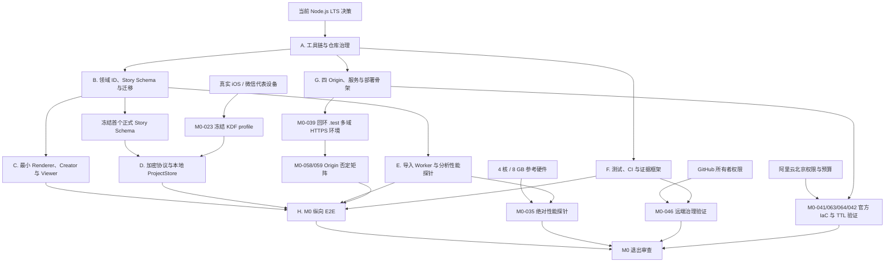

# DataPulse AI 实施计划

> 状态：M0 可执行计划  
> 基线日期：2026-08-04（Asia/Shanghai）  
> 当前焦点：M0 工程与正确性底座  
> 上位事实源：[领域词汇表](../CONTEXT.md)、[PRD](PRD.md)、[技术架构](ARCHITECTURE.md)、[实施路线图](ROADMAP.md)、[ADR](adr/)、[设计系统](../DESIGN.md)
> 执行状态：[M0 证据索引](evidence/m0/evidence-index.json)（本计划只定义任务与依赖）

本文把已确认的路线图转换为依赖有序、可以逐项验收的实施 backlog。它不替代 PRD、架构、ADR 或路线图，不新增产品范围；如出现冲突，先修正上位事实源或建立明确的取代决定，再修改实现。

## 1. 当前准备度

截至基线日期，仓库只有规划文档，尚未进入 M0 脚手架：

| 项目 | 当前状态 | 实施影响 |
|---|---|---|
| 产品、领域、架构、路线图、ADR、Agent 与设计规范 | 已建立并终审 | 可以开始 M0，不需要重新讨论 MVP 范围 |
| Git 仓库与 GitHub 远端 | 已在 `main` 初始化本地 Git，并配置空的公开远端 `origin=https://github.com/sora-yyds/DataPulse.git`；尚无 commit 或 push | Wave 0 已建立关联；许可证、治理文件、首个提交、分支保护、merge queue 和公开 Fork 验证仍按后续任务实施 |
| Node / pnpm | M0-003 已按一手资料固定 Node `24.19.0`、pnpm `11.20.0`、Corepack `0.35.0`；本机仍为 Node `20.20.2`、pnpm `10.34.4`、Corepack `0.34.6` | 本机尚未满足基线；M0-005 前必须切换并回读，不能用旧环境生成正式锁文件 |
| workspace、锁文件、Turbo 与根命令 | 不存在 | 必须先建立，当前不能声称任何工程命令已通过 |
| 应用、包、服务与基础设施目录 | 不存在 | 按架构依赖方向逐步创建，不一次生成没有消费者的空包 |
| 真实设备、GitHub 治理权限与阿里云测试资源 | 已在 [责任与资源登记](governance/m0-ownership-and-resources.md) 建档，具体设备、admin 能力和云资源仍未到位 | 不阻止无依赖的本地脚手架，但会阻止登记表所列真实验证和 M0 最终退出 |

## 2. 计划规则

1. 按依赖和风险排序，不按假设团队人数或日历日期排序。
2. 每项任务控制在约 0.5–2 个有效工程日；超过该粒度时，实施前必须继续拆分。
3. `S` 表示约 0.5–1 个有效工程日，`M` 表示约 1–2 个有效工程日；它们用于控制任务大小，不是交付日期承诺。
4. 每个 PR 至少产生一个真实可运行结果或真实失败断言；禁止用返回成功的空脚本占位。
5. 当前里程碑已到期但尚未实现的门槛标记为“计划中”或“未运行”，并使 **M0 退出聚合**失败；日常 PR/merge queue 聚合只运行已激活的真实门槛，某门槛必须在实现真实断言的同一 PR 中原子激活，激活后不得退回占位。“尚未到期”只适用于 M3 四主题完整组件矩阵、M4 的 30/200/100/1000 全量语料和正式外部认证，以及尚不存在适用历史正式主版本时的上一主版本兼容性，不能写成“通过”。
6. 原始数据、模型输出、跨 Origin 消息、项目包和发布物一律按不可信输入处理，在模块的 interface 处限尺寸、解析和校验。
7. M0 前半段可以使用 `0.x` 实验 Schema；在项目包固定向量、Project Repository 和纵向 E2E 开始前，必须先冻结首个正式版本并进入永久迁移承诺。不得为了测试迁移器而伪造已发布的产品历史。

## 3. M0 的唯一验收切片

M0 不是产品 Alpha，也不实现完整导入向导、4–8 区块基础生成、时间范围编辑、AI、分享或 3D。M0 必须交付下面这一条真实连通的工程切片：

```text
Creator 存储恢复链
  仓库合成表格
    → 资源准入与具体拒绝结果
    → Creator LocalAnalysis 的 BrowserWorkerAdapter
    → 禁网单文件 Worker 解析为 Arrow
    → DuckDB-WASM 产出版本化 MetricAccumulator
    → 共享 metric-runtime 求值
    → Evidence builder
    → generation 的 M0 确定性单 KPI adapter
    → Story Artifact Reader 校验正式 Story Schema
    → 设备密钥加密并以 OPFS 对象 + IndexedDB 提交索引保存
    → 刷新后恢复并在 Creator 渲染

Viewer 独立契约链
  仓库内同 Schema 版本、同内容 hash 的合成 Story fixture
    → Story Artifact Reader
    → 共享 metric-runtime + Viewer composition
    → 独立 Viewer Origin 渲染
```

两条链只通过版本化 fixture、Schema version 和 fixture hash 证明契约一致。Viewer 不读取 Creator 的 IndexedDB、OPFS 或设备密钥；不得增加测试专用跨 Origin 桥，也不得提前发明发布包旁路。

切片还必须证明：迁移失败不替换最后可读副本；带唯一标记的原文件 Blob 不进入 IndexedDB、OPFS、日志或网络，并在完成、取消和失败后释放；Worker 禁网；四 Origin、精确 CORS、Cookie 边界和 Connector 污染清理否定测试成立。这里的最小故事只用于连接 M0 技术链，不冒充 M1 的完整基础生成。

M0 必须以常见档 60 秒、边界档 3 分钟为上限运行技术可行性探针，并据此执行路线图的资源风险门槛；但该结果只记为 `NFR-PERF-001/002` 的阶段证据，完整可编辑草稿的需求状态仍保持“部分取证/待 M1 验收”。若 M0 的更短技术链已经无法兑现预算，必须在进入 M1 前下调公开输入上限，不能增加云端回退；通过 M0 探针也不得推断完整草稿已经通过。

## 4. 依赖图与并行边界



- A 与 B 位于关键路径前端，应先完成。
- B 稳定后，C、D、E 可以并行；F 与 G 可以从 A 后启动，但必须消费同一契约。
- H 之前不得用应用私有 DTO 临时绕过 Story Schema、Worker 消息 Schema 或存储事务。
- 外部证据可以与不依赖它的本地实现并行准备；它既可能阻止某条实现关键路径，也可能只阻止退出，具体以任务依赖和第 8 节为准。缺失时状态只能是“未运行/外部阻塞”，不能降级为模拟通过。

## 5. 深模块、interface 与 seam

下表给出 M0 需要优先稳定的模块形状。接口名是规划语义，具体 TypeScript 类型由对应契约任务和测试共同冻结。

| 模块 | 小 interface | 隐藏的实现复杂度 | seam 与测试策略 |
|---|---|---|---|
| `story-schema` | `validateCurrentStory(inProcessCandidate) -> ValidationResult` | Ajv 编译、当前版本结构/语义错误归一化、引用与条件检查 | 当前版本写入与内部迁移步骤的 seam；生成类型不能替代运行时校验。外部字节不得绕过 Artifact Reader 直接调用它 |
| Story Artifact Reader（由 `story-migrations` 提供） | `readStoryArtifact(input: Uint8Array \| string, limits) -> StoryReadResult` | **编码字节长度先验检查**、受控 UTF-8 解码/JSON 解析、版本识别、副本逐步迁移、每步校验、最终校验、原字节保留 | 本地项目、Viewer 和历史夹具统一读取 seam；也可接受 codec 产生的 branded `BoundedDecodedStory`。禁止无界 `JSON.parse` 后再调用 Reader，调用者不得自行挑迁移步骤或把未校验蓝图交给 Renderer |
| `metric-runtime` | `evaluate(plan, accumulators) -> MetricResultSet` | 固定合并顺序、不可用语义、单位/币种、精确集合并集 | 纯进程内深模块；Creator 与 Viewer 通过同一 interface 做黄金对比 |
| Creator `LocalAnalysis` | `run(request, abortSignal) -> progress/AnalysisResult` | 唯一版本化消息 Schema、task ID/nonce、transferable 元数据与字节上限、取消/释放状态机 | 外部 seam；`BrowserWorkerAdapter` 与 `InProcessTestAdapter` 必须通过同一 contract suite，消息 Schema 由该模块的受限 export 子路径唯一拥有 |
| `import-engine` | `runImport(request, abortSignal) -> ImportResult` | 准入、CSV/XLSX、Arrow、公式/链接拒绝和资源释放 | 只隐藏解析，不拥有 postMessage 或浏览器 Worker；合成输入、攻击夹具和取消路径通过同一 interface |
| `analysis-engine` | `analyze(input, plan, abortSignal) -> AnalysisResult` | DuckDB-WASM 查询编译、质量画像、确定性聚合与版本化 accumulator | 不暴露 DuckDB 连接或 SQL；只返回分析结果/accumulator，不直接生成 Evidence、文案或区块 |
| `evidence` + `generation` M0 adapter | `buildEvidence(analysisResult)` / `generateMinimalStory(evidence, controlledContext)` | 安全 Evidence 裁剪、引用绑定、确定性单 KPI 选择 | `generation` 只接受 Evidence 与受控上下文；不得读取原始 Arrow 行、`import-engine`、Project Repository 或任意模型输出 |
| `local-project-crypto` | `seal/open` 受控本地对象 | 设备不可导出密钥、purpose、nonce、AAD 与错误归一化 | Web Crypto 是本地依赖；固定向量与真实浏览器共同验证，不暴露密钥句柄给调用者 |
| `project-envelope`（归 `crypto` 所有） | `encodeProjectEnvelope(source, sink)` / `decodeProjectEnvelope(source, staging)` | JCS、Argon2id、4 KiB 头、1 MiB 分块、4 GiB/manifest 先验限制 | 流式字节 seam；恶意向量通过同一解码 interface；`package-codec` 保留给 M3 的 `story-package-v1`，不得重复实现项目包 framing |
| Project Repository（由 `local-storage` 提供） | `open/commit/recover/exportProject/importProject` | 设备密钥、备份大小预测、IndexedDB/OPFS 双存储、加密暂存、提交索引和项目包编排 | `open/recover/importProject` 的 Story 读取必须经过 Artifact Reader；调用者不能分别操作 IDB/OPFS 或绕过 crypto；单元替身验证状态机，Playwright 验证真实浏览器语义 |
| `renderer` | `render(validatedStory, resolvedData)` | 注册区块、主题角色、图表适用性、状态与等价说明 | 只接受已校验蓝图；M0 先支持标题/摘要与 KPI 最小子集，不接受任意 option/HTML |
| 分享服务内部状态 | `EphemeralStatePort`、`CipherObjectStorePort` | TTL、原子撤销、对象生命周期和供应商错误 | Tair/Valkey、OSS/S3-compatible 各有生产/社区/内存 adapter，因此是实际 seam；业务逻辑不泄露供应商 SDK |
| Connector | 版本化 postMessage contract | iframe 生命周期、nonce、来源、端点规则、无存储和安全纪元轮换 | 它是独立 Origin 的安全 seam，不与后端模型 adapter 合并，也不依赖 Creator 状态 |
| Origin Policy | 一份声明式 Origin/路由/响应头矩阵 | Creator/Viewer/API/Connector 的 CSP、CORS、Cookie、frame 与安全纪元配置 | 本地 HTTPS、Hono 和 IaC adapter 共同消费；禁止在 Vite、服务和云配置中维护三套漂移规则 |

`import-engine` 与 `analysis-engine` 不直接依赖。Worker 内部组合严格为 `import-engine -> ImportResult -> AnalysisInput adapter -> analysis-engine -> AnalysisResult`；Creator 外部只看 `LocalAnalysis`。这样 ExcelJS/Arrow 解析细节不会进入分析 interface，Browser Worker 和进程内测试也不会各自发明 DTO。

目标包依赖方向如下；M0 只实例化当前切片真正消费的部分，但依赖检查从第一天按完整方向阻止反向引用：

```text
domain              story-schema              themes
story-migrations -> domain + story-schema
metric-runtime   -> domain + story-schema
crypto           -> domain
import-engine    -> domain
api-contracts    -> domain
analysis-engine  -> domain + metric-runtime
evidence         -> story-schema + analysis-engine + metric-runtime
narrative        -> story-schema + metric-runtime
local-storage    -> domain + crypto + story-migrations
generation       -> story-schema + evidence + narrative
renderer         -> story-schema + themes
package-codec    -> domain + story-schema
provider-adapters -> api-contracts

creator          -> 创作端所需子集；composition 才组合 metric-runtime + narrative + renderer
viewer           -> schema/migrations/package-codec/metric-runtime/narrative/renderer/themes/crypto；composition 才组合求值与渲染
custom-connector -> api-contracts/connector-message（只能使用该受限 DTO export 子路径）
model-proxy      -> api-contracts + provider-adapters
share-api        -> api-contracts
telemetry-ingest -> api-contracts
static-export    -> renderer + themes
services/*       -/> import-engine / analysis-engine / local-storage
```

不为只有一个实现且没有真实变化点的代码创建抽象 port。测试需要的内部替身留在模块实现内部，不能为了 mock 方便扩大公共 interface。

## 6. M0 依赖有序 backlog

### Wave 0：封闭实施口径

| ID | 结果与验收 | 依赖 | 大小 |
|---|---|---|---:|
| M0-001 | 在 `docs/evidence/m0/` 建立版本化 M0 证据索引、原子 gate catalog、Schema、冻结 35 gate／67 任务及静态定义 hash 的退出 manifest、外部 subject/profile/attestation Schema、人工评审 attestation Schema 与语义验证器。每条记录只证明一个 gate，分别包含 `evidenceStatus`（计划中/进行中/通过/失败/未运行/外部阻塞）、`requirementStatus`（未开始/部分取证/已满足/尚未到期）、`milestoneScope`、`environmentKind`、执行类型、M0-E1～E6、需求 ID、ADR、fixture/subject/hash、测试/报告位置、观测时间和 append-only 前序；允许“本阶段证据通过、完整需求仍部分取证”，但所有冻结 gate 只有“通过且最新记录一致”才可能退出，自动 gate 还必须本次重跑，人工评审必须绑定唯一记录与最终主体 hash，外部 gate 必须绑定非模拟断言与当前被测文件 | 无 | S |
| M0-002 | 登记 GitHub 仓库所有者、维护者、`CODEOWNERS`、参考设备、真实移动设备、阿里云测试资源与官方托管域负责人；缺失项明确标为外部阻塞 | M0-001 | S |
| M0-003 | 冻结工具链决策：当前 Node.js LTS、pnpm 精确版本、包命名空间、实验/正式 Schema 版本策略、IaC 工具和社区对象存储候选；记录许可证与 Worker 兼容性 | M0-001 | M |

### Wave 1：仓库、治理与包边界

| ID | 结果与验收 | 依赖 | 大小 |
|---|---|---|---:|
| M0-004 | 初始化 Git，加入 AGPL-3.0、`.gitignore`、`.gitattributes`、`.editorconfig`、基础 README/CONTRIBUTING/SECURITY；不改写现有规划文档历史 | M0-002、003 | S |
| M0-005 | 建立根 `package.json`、pnpm workspace、精确锁文件、Turbo、严格 TypeScript 与版本固定文件；Windows 本地和干净 Ubuntu 可冻结安装 | M0-004 | M |
| M0-006 | 只创建 M0 有消费者的 apps/packages/services/infra/tests 目录、独立构建入口和公开 exports；不生成 M2/M3 的空实现 | M0-005 | M |
| M0-007 | 自动检查架构依赖方向和循环；Viewer、Connector、服务端越界依赖必须使 CI 失败 | M0-006 | S |
| M0-008 | 加入 Changesets、PR 模板、敏感路径 `CODEOWNERS`、Conventional Commit PR 标题检查和最小权限工作流约定 | M0-004、006 | S |
| M0-009 | 建立两类根聚合器并同步 `AGENTS.md` 第 8 节：日常 `verify:pr` 只运行 activation registry 中已有真实断言的根脚本；`verify:m0` 先验证冻结 manifest、Schema、外键、record 唯一链尾与相对 merge base 不可缩减，再为本次运行生成 nonce，重跑所有已激活自动 gate 并校验 `executed>=1/failed=0/skipped=0` 的新鲜 attestation。门槛在其真实断言、`rootScript` 与 check 名落地的同一 PR 中原子激活，缺断言不得进入日常绿色聚合；明确属于 M3/M4 的能力可报告“尚未到期”但不得进入 M0 退出清单 | M0-005、006 | M |

计划中的根入口至少包括：格式检查、lint、类型检查、Design lint、单元/组件/Storybook/E2E/视觉/无障碍/性能/语料、构建、PR 快检、完整验证和 release dry-run。具体命令只有脚本真实存在后才写入 `AGENTS.md`，本文不把它们冒充当前可执行命令。

### Wave 2：Story 契约与最小渲染

| ID | 结果与验收 | 依赖 | 大小 |
|---|---|---|---:|
| M0-010 | 实现领域 ID、版本注册、稳定错误码和可区分 Result DTO；沿用 `CONTEXT.md` 术语 | M0-006 | S |
| M0-011 | 定义实验 StoryBlueprint Schema，覆盖版本、数据集引用、全局/区块条件、证据/叙事引用、注册区块、布局、主题和视觉选择；关闭额外属性与任意代码配置 | M0-010 | M |
| M0-012 | 从 Schema 生成类型，建立 Ajv 结构校验、尺寸限制与引用/条件/图表适用性语义校验；未知引用、区块条件放宽和硬编码额外数值均失败 | M0-011 | M |
| M0-013 | 建立 Story Artifact Reader、复制迁移执行器、版本注册表、实验样本、未知/恶意样本和失败不替换测试；Reader 必须先按编码字节限尺寸再解码/解析，调用者不能绕过统一读取 seam | M0-012 | M |
| M0-048 | 冻结首个正式 Story Schema；重新生成类型和 Schema hash，产出正式 Creator/Viewer fixture 及 hash，并将实验样本明确标记为未发布开发样本。此后兼容变化只能新增版本/迁移，不覆写正式历史 | M0-013 | S |
| M0-049 | 定义版本化 `MetricAccumulator` Schema 与最小纯 `metric-runtime`，覆盖 `COUNT_ROWS`、`SUM`、稳定 merge/finalize 顺序、数值边界和不可用错误；Creator/Viewer 对同一 accumulator 的黄金结果逐值一致 | M0-048 | M |
| M0-014 | 从 `DESIGN.md` 生成或自动核对主题语义 Token；固定 Design CLI 版本并记录既有 warning 基线，新错误或未审查 warning 阻断 | M0-005 | S |
| M0-015 | 建立只依赖 `story-schema + themes` 的最小二维 Renderer，以及独立 Creator/Viewer 页面；两端经 Story Artifact Reader 读取正式标题/摘要/KPI fixture，composition 使用同一 `metric-runtime`，Renderer 不计算指标或叙事 | M0-014、048、049 | M |

### Wave 3：测试、CI 与可复现证据

| ID | 结果与验收 | 依赖 | 大小 |
|---|---|---|---:|
| M0-016 | 配置 Vitest、React Testing Library、Storybook、Playwright 与 axe；每个 runner 至少有一个真实产品断言 | M0-009、015 | M |
| M0-017 | 建立 fixture manifest，记录 ID、用途、固定种子、生成器版本、预期结果与 hash；大型夹具确定性生成，不提交真实用户数据 | M0-010、016 | M |
| M0-018 | 固定 `zh-CN`、`Asia/Shanghai`、字体、浏览器、视口、随机种子和弱动效；对 M0 最小页建立视觉、键盘、焦点与 200% 缩放冒烟 | M0-014～017 | M |
| M0-019 | GitHub Actions：PR 快检、`merge_group` 当前**已激活**完整矩阵、`main` 复核、M0 退出候选与标签 release dry-run；提供稳定命名的日常 required aggregate，以及独立的 `verify:m0` 退出 aggregate。已激活项失败必须非零，未实现项不能伪装通过但不锁死日常合并；最小权限、无 `pull_request_target`、Fork 路径无 secrets/付费 SaaS | M0-008、M0-016～M0-018 | M |
| M0-020 | release dry-run 生成构建物、校验和与 SBOM；只证明供应链骨架，不创建或宣传公开 MVP | M0-019 | S |
| M0-046 | 在真实 GitHub 远端配置并回读 protected `main`、merge queue、squash merge 和**日常已激活聚合** required check；用一次失败 PR/merge-group 与直接推送否定验证证明日常门槛无法绕过。`verify:m0` 保持独立退出检查，不在 Wave 3 设成每个 PR 都必须通过；把 ruleset 与测试 PR 证据写入索引 | M0-019；仓库所有者权限 | M |

### Wave 4：项目加密与本地存储

| ID | 结果与验收 | 依赖 | 大小 |
|---|---|---|---:|
| M0-021 | 实现 JCS、base64url、purpose 隔离 AES-GCM、profile 注册和固定向量；**固定 key/nonce 只允许出现在测试向量**。生产随机材料在协议规定的创建时点由 Web Crypto CSPRNG 生成且不得复用：每次加密使用新 nonce，每次项目包导出使用新 packageId/包密钥/salt/nonce prefix；设备密钥仅在首次设备绑定时生成并以不可导出形式持久化 | M0-010、016 | M |
| M0-022 | 评估并接入可审计 Argon2id WASM，建立 KDF/AES/JCS/Fragment 最小设备探针页；不得允许链接携带任意 KDF 参数 | M0-021 | M |
| M0-023 | 在 Chrome、Edge、当前 iOS Safari、Android 微信和 iOS 微信代表设备运行固定探针；一致且单次 ≤5 秒、无内存终止后冻结 profile，否则使用新 profile ID 重跑 | M0-022；外部设备 | S |
| M0-024 | 以正式 Schema version/hash 重新生成固定向量，实现 `project-envelope-v1` 的 4 KiB 头、Schema、4 GiB/计数/framing 先验拒绝和首块认证后的 1 MiB manifest 限制 | M0-021、023、048 | M |
| M0-025 | 实现 1 MiB 独立认证分块流式加解密；覆盖首/中/尾、重排、重复、截断、尾随、篡改、错误口令和未知 profile | M0-024 | M |
| M0-026 | 实现不可导出设备密钥、设备绑定对象 `seal/open`、持久存储能力请求与稳定错误；真实浏览器验证密钥句柄不外泄，清除站点数据后不可恢复 | M0-021 | M |
| M0-051 | 实现写入前“可用配额 + 完整备份 payload ≤4 GiB”双估算；新增版本/资源超限时在分配和提交前明确拒绝，不修改最后可读索引 | M0-026、048 | S |
| M0-052 | 实现 OPFS 加密对象先写、IndexedDB 提交索引后写的事务核心；覆盖崩溃点、孤儿暂存、幂等恢复和最后一致索引，不把原文件 Blob 当作项目对象保存 | M0-026、051 | M |
| M0-027 | 在事务核心上实现 Project Repository 的 `open/commit/recover`；所有 Story 读取经过 Artifact Reader，集成 Creator 保存与刷新恢复，迁移/解密/提交失败保留最后可读副本 | M0-015、048、052 | M |
| M0-053 | 集成 `project-envelope-v1` 的流式导出与加密暂存导入；导入完整认证和 Story Artifact Reader 校验后才提交，覆盖失败清理、最后可读副本与固定互操作往返 | M0-025、027 | M |

### Wave 5：资源准入、Worker 与分析探针

| ID | 结果与验收 | 依赖 | 大小 |
|---|---|---|---:|
| M0-028 | 定义导入探针 DTO、进度/取消状态和包含具体观测值的稳定拒绝错误；建立小型、常见、20 万行窄表、50 MB/100 列较短宽表及早期攻击夹具 | M0-010、017 | M |
| M0-029 | 实现文件/行/列/非空单元格、`.xlsx` ZIP 目录/解压大小/压缩比和工作内存静态估算；超限完整拒绝 | M0-028 | M |
| M0-030 | 定义 Creator `LocalAnalysis` interface 及唯一版本化消息 Schema；校验 task ID、每请求 nonce、transferable 类型/长度/总字节上限和状态转换，实现通过同一 contract suite 的 `InProcessTestAdapter` | M0-012、028 | M |
| M0-031 | 实现 `BrowserWorkerAdapter` 与无运行时 import 的单文件模块 Worker 外壳；主线程在交付标记原始数据前预取、hash 校验并克隆固定 WASM，Worker 不自行下载依赖 | M0-029、030 | M |
| M0-032 | 建立 Worker 响应 CSP 与 fetch/WebSocket/EventSource/sendBeacon/dynamic import/importScripts/嵌套 Worker 否定测试；完成、取消、超时和失败都终止任务并释放 transferable/Worker 引用 | M0-031 | M |
| M0-054 | 在 `import-engine` 实现 UTF-8/GBK/GB18030 CSV 的流式准入、解析与 Arrow 输出；编码不确定、畸形行和资源超限返回具体稳定错误，不静默替换或截断 | M0-029 | M |
| M0-055 | 在 `import-engine` 实现受控 `.xlsx` 到 Arrow 路径；只读缓存公式结果，不执行公式、宏或外部链接，并复用 ZIP/内存先验拒绝 | M0-003、029 | M |
| M0-033 | 实现只接收 `AnalysisInput` 的 `analysis-engine` 探针，DuckDB-WASM 执行 `COUNT_ROWS` + `SUM` 并只返回 `AnalysisResult`/版本化 accumulator；不得直接产出 Evidence、文案或 Story 区块 | M0-028、049 | M |
| M0-056 | 在 Worker 内按 `ImportResult -> AnalysisInput -> AnalysisResult` 组合 `import-engine` 与 `analysis-engine`，使 BrowserWorker/InProcess 两个 adapter 通过同一结果、取消和资源释放 contract；两引擎保持无直接依赖 | M0-031～033、054、055 | M |
| M0-050 | 实现最小 Evidence builder 与归 `generation` 所有的确定性单 KPI adapter；Evidence builder 用共享 `metric-runtime` 将 `AnalysisResult` 转为安全 Evidence，generation adapter 只接受 Evidence/受控上下文并输出经正式 Story Schema/引用规则校验的蓝图 | M0-015、033、048、049 | M |
| M0-057 | 用带唯一标记的原文件 fixture 做驻留否定测试：成功、取消、解析失败后，IndexedDB、OPFS、日志和网络均无原文件 Blob/标记，`LocalAnalysis` 资源所有者已显式释放 File/Blob/Worker 引用；规范化加密数据可按协议保存但不得等同于原文件 | M0-027、032、056 | M |
| M0-034 | 建立两轨性能工具：首次由固定环境/fixture hash 生成候选 `main` 基线并经显式审查提交，后续 `merge_group` 预热后多次取中位数并在相对基线退化 `>15%` 时非零；CI 不自动改写基线。参考设备另以外部进程内存观测 + 静态估算验证绝对预算，不把不稳定 CI 硬件冒充参考设备 | M0-027、050、056 | M |
| M0-035 | 在 4 核/8 GB/集显参考设备的真实 Chrome/Edge 运行小型、常见、窄边界与宽边界技术链，形成耗时、峰值内存、失败原因和公开上限决策报告；记录为 `NFR-PERF-001/002` 阶段证据而非完整草稿通过 | M0-034；外部硬件 | S |
| M0-047 | 实现并运行根 `test:corpus`：校验 fixture manifest/种子/生成器版本/hash，确定性生成 M0 小型、常见、窄表、宽表和当前攻击夹具，执行适用的准入、拒绝与分析探针断言并输出无网络报告；30/200/100/1000 全量仍标记 M4 尚未到期 | M0-017、029、M0-032～M0-034、M0-054～M0-057 | M |

### Wave 6：四 Origin、服务与部署骨架

| ID | 结果与验收 | 依赖 | 大小 |
|---|---|---|---:|
| M0-036 | 建立一份声明式 Origin/路由/响应头矩阵，并据此生成 Creator、Viewer、API、Connector 四 Origin 配置、共享 `api-contracts` 和最小 Hono 服务；服务不依赖本地分析实现 | M0-006、010、015 | M |
| M0-037 | 落地逐路由精确 CORS、各应用 CSP、无 Cookie、Authorization/正文/证据/密文日志脱敏和稳定错误响应 | M0-036 | M |
| M0-038 | 建立不含供应商业务调用的 Connector 安全探针：每请求 iframe、精确来源、nonce/消息 Schema、`credentials: omit`、无持久化、`Clear-Site-Data`、`no-store`、禁 Service Worker 与旧纪元拒绝 | M0-037 | M |
| M0-039 | 建立 Fork 可复现的本地 HTTPS harness：把多个独立 `.test` 可注册域映射到回环地址，生成临时本地 CA/证书并在测试 runner 信任，使用生产式 HTTPS server 启动四 Origin 与 Connector 安全纪元；不同端口不得作为 Cookie 隔离证据，不需要外部域名、secret 或付费服务 | M0-038 | M |
| M0-058 | 在 M0-039 环境运行 Creator/Viewer/API/Connector 的 IDB、OPFS、Cache、Cookie 与 Service Worker 隔离/清理矩阵；验证 Connector 首个 HTML 响应执行代码前清理且不影响其他 Origin，污染纪元只能轮换 | M0-039 | M |
| M0-059 | 运行伪造来源/nonce/超限消息、宽松 CORS、凭据携带与 Worker 禁网集成否定矩阵；所有探针产生可机器判定的稳定失败证据 | M0-032、039 | S |
| M0-060 | 定义强制 TTL 的 `EphemeralStatePort` contract，并实现内存、Valkey 和 Tair 薄 adapter；无 TTL、续期越界和供应商含糊成功都拒绝，业务层不接触供应商 SDK | M0-036 | M |
| M0-061 | 定义只处理不透明密文字节的 `CipherObjectStorePort` contract，并实现内存、S3-compatible 和 OSS 薄 adapter；覆盖条件写入、删除、not-found 与供应商错误归一化 | M0-036 | M |
| M0-062 | 实现仅供 M0 探针使用的双路径清理核心：生命周期策略声明 + 幂等定时清理处理器；写入带过期时间的不透明测试对象/状态，覆盖失败重试、孤儿对象、状态先失效/对象先删除和禁止内容日志，不提前实现 M3 分享 API | M0-060、061 | M |
| M0-040 | 建立社区 Creator、Viewer、API 与独占 Connector 可注册域的四 Origin 参考编排，启动时拒绝单 Origin、同一可注册域 Connector 或缺失安全头 | M0-003、037 | M |
| M0-066 | 为社区参考编排接入 S3-compatible 密文对象存储与 Valkey，只暴露 M0 探针所需配置，应用层不创建账号、项目或用户内容数据库 | M0-040、060、061 | M |
| M0-041 | 建立阿里云北京 Creator、Viewer、独占 Connector 静态 Origin、证书与 CDN 公开 IaC；Connector 使用不承载其他应用的独占可注册域 | M0-003、037；阿里云权限 | M |
| M0-063 | 建立阿里云北京 API 网关 + 函数计算无状态 API 骨架；逐路由 CORS/日志策略来自统一 Origin Policy，不创建长期内容数据库 | M0-037、041；阿里云权限 | M |
| M0-064 | 建立阿里云北京密文 OSS Bucket、≤24 小时生命周期和 Tair 公开 IaC；默认加密、最小权限、强制 TTL 与定时清理触发配置可审计 | M0-003、060、061；阿里云权限 | M |
| M0-065 | 在社区环境写入不透明测试对象和 TTL 状态，分别证明对象生命周期与定时处理器两条删除路径、Valkey 强制 TTL、失败/孤儿恢复及禁止内容日志扫描 | M0-062、066 | M |
| M0-042 | 在真实阿里云测试环境重复官方路径：OSS 生命周期与定时处理器都删除测试密文，Tair 测试键强制 TTL，日志无禁止内容；模拟或 IaC plan 不能替代该证据 | M0-041、M0-062～M0-064；阿里云权限/预算 | M |

### Wave 7：纵向集成与 M0 退出

| ID | 结果与验收 | 依赖 | 大小 |
|---|---|---|---:|
| M0-043 | Creator Playwright 链：准入 → `BrowserWorkerAdapter` → accumulator → `metric-runtime` → Evidence → M0 generation → Artifact Reader → 加密提交 → 刷新恢复 → Creator 渲染；成功/取消/失败保持最后一致状态且满足原文件驻留否定断言 | M0-027、050、057、059 | M |
| M0-067 | Viewer Playwright 独立链：只从仓库正式合成 fixture 的有界字节经 Artifact Reader、共享 `metric-runtime` 和 Viewer composition 渲染；校验 Schema version/fixture hash 与 Creator 契约一致，并证明 Viewer Origin 不能读取 Creator IDB、OPFS 或设备密钥 | M0-015、048、049、058 | M |
| M0-044 | 在干净公开 Fork 重跑冻结安装、构建、当前全部测试、社区自部署冒烟与 release dry-run；记录必须显式包含 `test:corpus`、本地 `.test` HTTPS 安全矩阵、项目包往返及 Creator/Viewer 两条独立链，并把真实命令、触发条件和通过标准写回 `AGENTS.md` | M0-019、020、040、043、047、053、065、067 | M |
| M0-045 | 在 M0 退出候选运行独立 `verify:m0`，汇总 Schema/迁移、项目包固定向量、设备、性能阶段证据、当前语料、原文件驻留、Origin/Worker、社区/官方 TTL、GitHub 治理、CI 和 Fork 证据；冻结 manifest 中任一 gate 不是“通过”、缺少状态／快照一致的唯一最新 passed record、自动 gate 没有本次新鲜 attestation，或外部 provenance 不匹配当前 subject，均非零失败。不得把 `requirementStatus=部分取证` 改写为已满足，并用失败退出候选证明该检查不可绕过 | M0-023、035、042、044、046、047、M0-057～M0-059、065、067 | S |

## 7. 需求与证据矩阵

| M0 证据域 | 映射需求 | M0 取证边界 | 主要 ADR | 最终证据 |
|---|---|---|---|---|
| Monorepo 与治理 | `NFR-REL-001`–`006`、`NFR-QA-002/005` | 对 M0 当前仓库治理可形成完整证据；正式发布认证仍未到期 | 0028–0030、0037–0040、0043–0044 | 锁文件、依赖图检查、CI、ruleset 测试 PR、release dry-run、SBOM |
| Story Schema 与迁移 | `NFR-SCHEMA-001`–`004`、`FR-ANA-009` | 正式最小 Story 契约可完成；M1 的完整区块/编辑行为仍未开始 | 0002、0036、0048、0051 | Schema/hash、生成类型、Ajv/语义测试、迁移/恶意 fixture、两端独立渲染 |
| 确定性指标与分析契约 | `FR-ANA-011`、`FR-MET-009` | 只冻结最小 accumulator、共享运行时和两个 LocalAnalysis adapter；完整指标构建与分析仍待 M1 | 0031、0051 | accumulator Schema、merge/finalize 黄金结果、Creator/Viewer 逐值一致与 adapter contract |
| 本地存储与加密 | `FR-PROJ-003`–`009`、`SEC-001/005/007` | 项目包与 Project Repository 原型取证；M1 完整项目体验不由 M0 宣告完成 | 0017、0019、0020、0033、0047 | 固定向量、浏览器探针、恶意包测试、IDB/OPFS 提交与往返 |
| 导入与性能探针 | `FR-IMP-001`–`010`、`NFR-PERF-001/002/007`、`SEC-009` | 只覆盖准入、代表解析、技术链绝对预算和相对回归；导入产品闭环及完整可编辑草稿保持“部分取证/待 M1” | 0020、0031、0039、0050 | 夹具、准入/驻留断言、Worker 禁网、性能 JSON/Markdown 报告、上限决策 |
| 四 Origin 与临时云 | `SEC-002/003/005/008/009/010` | 覆盖隔离与不透明测试对象清理；不冒充 M2 自定义供应商调用或 M3 分享 API | 0030、0034、0035、0046 | HTTPS 否定矩阵、CSP/CORS 断言、TTL/删除记录、IaC plan/apply 证据 |
| 当前质量矩阵 | `NFR-QA-001`–`005` | 只评价 M0 当前切片；M3 四主题完整视觉矩阵、M4 全量语料与正式认证仍未到期 | 0037–0040、0052 | 单元/组件/Storybook/E2E/视觉/无障碍/性能当前适用结果与干净 Fork 记录 |

需求映射只说明“为什么收集这份证据”，不等于需求完成。证据索引必须同时显示 `evidenceStatus` 与 `requirementStatus`；例如 M0 性能技术链可以为“证据通过”，而 `NFR-PERF-001/002` 仍为“部分取证”。尚无上一正式主版本时，观看兼容性标记为“尚未到期”，不能伪造历史版本通过记录。

## 8. 外部前置与阻塞管理

外部前置不会一律等到退出才生效；有些会直接阻止其下游实现。下表是权威阻塞关系，未列出的独立任务可以并行推进。

| 前置 | 首个被阻塞任务 | 下游影响 | 未满足时状态 |
|---|---|---|---|
| GitHub 组织/仓库、维护者、分支保护与 merge queue 权限 | M0-046 | 远端治理 → M0-045 | 本地 CI 可编写；真实 ruleset/否定 PR 为“外部阻塞”，M0 不得退出 |
| 当前 Node.js LTS 的精确版本与本机升级方式 | M0-003/005 | 工具链 → 锁文件 → 全部工程任务 | 不生成正式锁文件，不以 Node 20 环境冒充支持基线 |
| 4 核/8 GB/集显参考 Windows/macOS 设备 | M0-035 | 绝对性能证据 → M0-045 | CI 仅保留相对回归轨；绝对预算为“外部阻塞” |
| 当前 iOS Safari、Android 微信、iOS 微信代表设备 | M0-023 | profile 冻结 → M0-024/025 → M0-053 项目包 → M0-044/045 | 不实现依赖未冻结 profile 的正式项目包，不以桌面模拟代替 |
| 阿里云北京权限、预算、备案/测试域、真实 CDN/证书、OSS/函数计算/API 网关/Tair | M0-041 | M0-041/063/064/042 → M0-045 | 官方托管域、IaC apply、删除和 TTL 证据为“外部阻塞”；不得替代 Fork 的本地 `.test` 安全矩阵 |
| FCv3 托管 Node 24 的北京地域真实支持，或选择固定 Node 24 custom runtime/container 的新增／取代 ADR | M0-063 | 官方无状态 API → ALIYUN-IAC → M0-045 | 与云账号／预算分开保持“外部阻塞”；Provider `1.287.0` 白名单只有 `nodejs20`，不得静默降级。真实托管支持或替代 ADR 二者均无时，即使资源已到位也不能解除 |
| Argon2id、JCS、ZIP 预检库的许可证/维护状态/Worker 打包评估 | M0-003 | M0-022/029/055 及其下游 | 不写自创密码学或不受控解压旁路；候选未通过则更换并重评 |

## 9. M0 完成定义

只有以下条件全部成立，M0 才能标记完成：

- M0-E1～E6 的当前交付物在干净环境可复现，merge queue 当前适用门槛全部绿色。
- Creator 存储恢复链与 Viewer 仓库 fixture 独立链都可复现；两者只以正式 Schema version/fixture hash 对齐，不存在跨 Origin 存储旁路。
- 首个正式 Story Schema 已冻结；未知版本/引用/字段和迁移失败都不会污染原项目。
- 项目包 4 GiB/1 MiB/framing 先验限制、固定分块与恶意向量通过；完整导入失败不替换最后可读项目。
- Argon2id profile 在五类支持/代表环境固定向量一致、单次 ≤5 秒且不发生内存终止。
- 原文件 Blob 在成功、取消和失败路径均不进入 IDB/OPFS/日志/网络且引用被释放；只允许规范化加密项目数据按协议持久化。
- 资源边界有真实参考设备证据；M0 只把完整草稿性能需求记为“部分取证”。若技术链无法兑现现行预算，已在 M1 前下调上限并同步 PRD/架构/夹具。
- 四 Origin、独占 Connector 可注册域、Worker 禁网、精确 CORS、Cookie/Clear-Site-Data 和旧纪元拒绝否定测试通过。
- 社区和官方部署骨架证明无长期用户内容数据库；不透明测试对象的生命周期/定时清理、孤儿恢复和 Tair/Valkey TTL 都有真实证据。
- 根命令、CI、证据 Schema／退出 manifest／索引和 `AGENTS.md` 与实际实现一致；35 个 gate 和 67 个任务不可缩减，record 历史只追加且唯一链尾一致，没有 skipped、旧报告、模拟或占位被表述为通过。
- `test:corpus` 已真实生成并执行当前 M0 夹具；日常 required aggregate 的全部已激活门槛通过，独立 `verify:m0` 对所有 M0 到期门槛强制 fail-closed；只有后续里程碑能力可保持“尚未到期”。

## 10. 首批实施批次

首批按三个可独立审查的 PR 执行，不跨过依赖：

1. **PR-A｜实施口径：** `M0-001` → `M0-002` → `M0-003`。结果是证据结构、责任人/外部阻塞清单和经核实的 Node/pnpm/依赖候选决策；若 Node 或库评估未完成，PR-A 如实停在对应任务，不启动锁文件。
2. **PR-B｜公开仓库基础：** `M0-004` → `M0-005` → `M0-006`。结果是 Git/AGPL 基础、冻结安装、workspace/Turbo/strict TypeScript 和只含真实消费者的目录；不创建业务空包。
3. **PR-C｜边界与质量入口：** `M0-007`、`M0-008`、`M0-009`、`M0-014`。结果是依赖规则、治理文件、真实 foundation 检查和固定 Design lint。`verify:m0` 此时应因尚未完成的 M0 门槛而明确失败，不能伪装绿色；`AGENTS.md` 只记录此时确实存在的精确命令。

PR-C 完成后，新贡献者应能在干净目录冻结安装并运行当前 foundation 快检；M0 总聚合仍保持 fail-closed。下一批进入 `M0-010`～`M0-015`、`M0-048/049` 的 Story 契约和最小渲染链。

## 11. M1 预览与停止线

M0 完成前不把 M1 拆成逐文件任务。M1 只保留以下依赖有序 Epic：

1. 受控 `.xlsx`/CSV 导入、范围选择、字段角色与可见假设；
2. 确定性质量语义、纯 `metric-runtime` 与受控指标表达式；
3. 4–8 区块基础生成和受限草稿；
4. 时间范围/条件直接编辑、联动重算、撤销/重做和自动保存；
5. 不可变数据集版本、明确故事检查点和正式项目包恢复闭环。

只有 M0 的 Schema、存储、加密 profile、资源上限和 Worker/Origin 假设已经有证据，才把 M1 Epic 拆为实现任务。AI、模型供应商、发布分享、完整四主题、3D 和静态导出继续分别留在 M2/M3，不得回流 M0/M1。

## 12. 维护规则

- 每次任务状态变化同时更新 `docs/evidence/m0/evidence-index.json`；本计划只定义任务与依赖，不通过口头记忆或计划正文维护证据状态。
- 任务若改变产品行为、信任边界、协议、Schema 兼容或 MVP 范围，先按 `AGENTS.md` 更新对应事实源/ADR。
- 已完成任务保留 ID 和最终证据链接；取消任务保留 ID、原因及替代项，不复用编号。
- 每个里程碑退出后，为下一里程碑建立新的依赖有序 backlog；不要一次为 M4 预测全部文件和实现细节。
